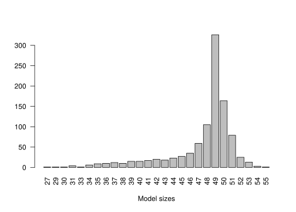
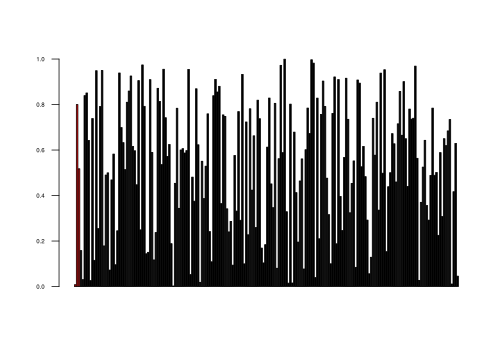
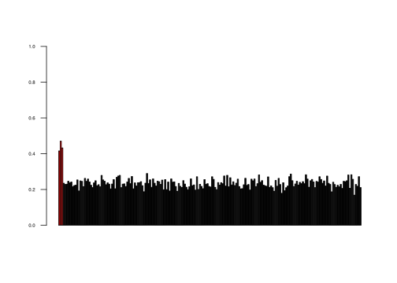
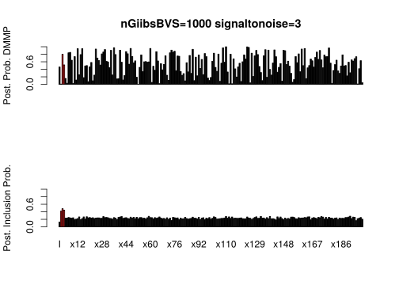
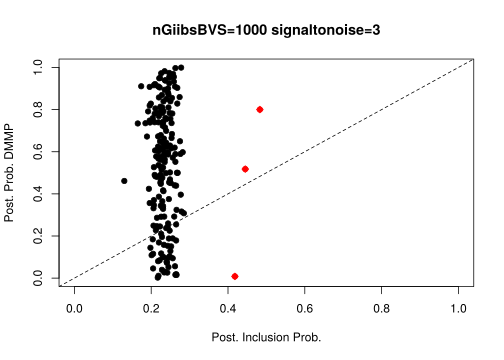

Set up
======

    rm(list=ls()) 
    set.seed(11) 
    library(BayesVarSel) 

    ## Loading required package: MASS

    ## Loading required package: mvtnorm

    ## Loading required package: parallel

    library(mixdir) 
    p=200 
    n=50 
    nsim.gibbs=1000
    m1=3 
    signaltonoise=3 

Suppose we have 200 covariates and 50 iid observations from a regression
model where intercept and 197 coefficients are zero while the first 3
covariates are 3 and errors with variance 1.

    x=cbind(1,array(rnorm(n*p,0,1),dim=c(n,p))) 
    betas=c(0,c(1,1,1)*signaltonoise,rep(0,p-3)) 
    colnames(x)=c("I",paste("x",1:p,sep="")) 
    true.mod=(betas>0)*1 
    names(true.mod)=colnames(x) 
    y=x%*%betas+rnorm(n,0,1) 
    simdat=data.frame(y,x) 

Usual analysis with Gibbs sampling on model space.
==================================================

Suppose to explore the model space with 1000 steps using Gibbs Sampling,
starting from the full and assuming a constant prior on model space
(only to perform Gibb Sampling). BF factors are calculated using the
conventional prior.

    res.GibbsBvs<- GibbsBvs(formula= y ~ ., data=simdat, prior.betas="gZellner", 
                            prior.models="Constant", n.iter=nsim.gibbs, init.model="Null", n.burnin=100, 
                            time.test = FALSE)

    ## Info. . . .
    ## Most complex model has 202 covariates
    ## From those 1 is fixed and we should select from the remaining 201 
    ## I, x1, x2, x3, x4, x5, x6, x7, x8, x9, x10, x11, x12, x13, x14, x15, x16, x17, x18, x19, x20, x21, x22, x23, x24, x25, x26, x27, x28, x29, x30, x31, x32, x33, x34, x35, x36, x37, x38, x39, x40, x41, x42, x43, x44, x45, x46, x47, x48, x49, x50, x51, x52, x53, x54, x55, x56, x57, x58, x59, x60, x61, x62, x63, x64, x65, x66, x67, x68, x69, x70, x71, x72, x73, x74, x75, x76, x77, x78, x79, x80, x81, x82, x83, x84, x85, x86, x87, x88, x89, x90, x91, x92, x93, x94, x95, x96, x97, x98, x99, x100, x101, x102, x103, x104, x105, x106, x107, x108, x109, x110, x111, x112, x113, x114, x115, x116, x117, x118, x119, x120, x121, x122, x123, x124, x125, x126, x127, x128, x129, x130, x131, x132, x133, x134, x135, x136, x137, x138, x139, x140, x141, x142, x143, x144, x145, x146, x147, x148, x149, x150, x151, x152, x153, x154, x155, x156, x157, x158, x159, x160, x161, x162, x163, x164, x165, x166, x167, x168, x169, x170, x171, x172, x173, x174, x175, x176, x177, x178, x179, x180, x181, x182, x183, x184, x185, x186, x187, x188, x189, x190, x191, x192, x193, x194, x195, x196, x197, x198, x199, x200
    ## The problem has a total of 3.213876e+60 competing models
    ## Of these, 1100 are sampled with replacement
    ## Then, 1000 are kept and used to construct the summaries
    ## Working on the problem...please wait.

From exploration steps we need at least the set of visited models in all
performed Gibbs steps (BFs are ignored). These are our observations.

    xx=res.GibbsBvs$modelslogBF 
    dim(xx) 

    ## [1] 1000  202

    ww=xx[,ncol(xx)] 
    xx=xx[,-ncol(xx)] 
    image(xx[,1:10]) 

This matrix is the of 0/1s that provides evidence for the true model
into a part of the model space. In this case the explored models have
the following sizes:

    barplot(table(rowSums(xx)),xlab="Model sizes",las=2)

A refinement using DPMP with MMDai
==================================

Not all models into the model space can be visited, only those with
*p* − *n* − 1 covariates (149 in this case). The full model space is
given by the hyper contingency table made by crossing *p* 0/1
categorical variables with 2 levels and thus by 2*p* cells
(1.60693810^{60} in this case). On the probability distribution of such
contingency table we assume a Dirichlet process prior (which is the
prior on model space) and the data are the samples from Gibbs step. This
model is proposed here Dunson and Xing (2009).

    mdat=data.frame(xx)+1

Posterior of cells probabilities (and thus models) is obtained using the
variational algorithm detailed in Ahlmann-Eltze and Yau (2018)
(otherwise Gibbs sampling would be used as originally proposed in Dunson
and Xing (2009)). We assume that the latent space has dimension 2: the
space with covariates with cells with high probabilities (in which it is
supposed to lie the true model) and the set of cells with low
probabilities (in which there is not the true model)

    library(MMDai)

    ## Loading required package: DirichletReg

    ## Loading required package: Formula

    ## Loading required package: rgl

    ## Warning in rgl.init(initValue, onlyNULL): RGL: unable to open X11 display

    ## Warning: 'rgl_init' failed, running with rgl.useNULL = TRUE

    res <- ParEst(mdat,d=rep(2,ncol(mdat)),k=2)

Given one of the latent spaces, each covariate has a probability to be 1
or 0 (i.e. included or not included in the model). Let’s analyse each
latent space separately:

The posterior probability of each covariate for the first latent space
is (first 3 covariates belong to this latent space with high
probability):

    pls1=unlist(unlist(lapply(res$psi,function(x) x[2,2]))) 
    barplot(pls1[-1],col=c(rep(2,m1),rep(1,p-m1)),las=2,cex.axis=0.5,ylim=c(0,1)) 

The posterior probability of each covariate for the second latent space
(which represents the null model):

    pls2=unlist(unlist(lapply(res$psi,function(x) x[1,2]))) 
    barplot(pls2[-1],col=c(rep(2,m1),rep(1,p-m1)),las=2,cex.axis=0.5,ylim=c(0,1)) 

Comparison among the two analysis
=================================

Let’s compare the posterior inclusion probability with just Gibbs
sampling with the posterior probability using the DPMP:

    exdetail=paste("nGiibsBVS=",nsim.gibbs,
                   " signaltonoise=",signaltonoise,sep="") 
    par(mfrow=c(2,1)) 
    barplot(pls1,col=true.mod+1, 
            main=exdetail, 
            ylab="Post. Prob. DMMP",ylim=c(0,1)) 
    barplot(res.GibbsBvs$inclprob,col=true.mod+1,
            ylab="Post. Inclusion Prob.",ylim=c(0,1)) 

    par(mfrow=c(1,1)) 
    plot(res.GibbsBvs$inclprob,pls1,col=true.mod+1,cex=1,pch=19, 
         xlab="Post. Inclusion Prob.",ylab="Post. Prob. DMMP",main=exdetail,ylim=c(0,1),xlim=c(0,1)) 
    points(res.GibbsBvs$inclprob[true.mod==1],pls1[true.mod==1],col=2,cex=1,pch=23) 
    abline(0,1,lty=2) 

References
==========

Ahlmann-Eltze, Constantin, and Christopher Yau. 2018. “MixDir: Scalable
Bayesian Clustering for High-Dimensional Categorical Data.” In *2018
Ieee 5th International Conference on Data Science and Advanced Analytics
(Dsaa)*, 526–39. IEEE.

Dunson, David B, and Chuanhua Xing. 2009. “Nonparametric Bayes Modeling
of Multivariate Categorical Data.” *Journal of the American Statistical
Association* 104 (487): 1042–51.
