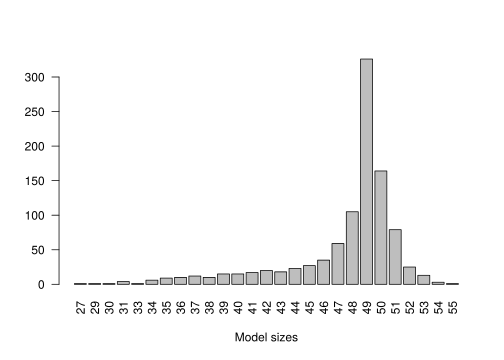
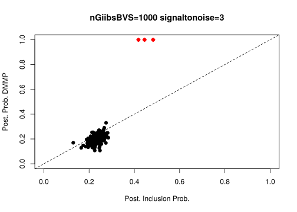
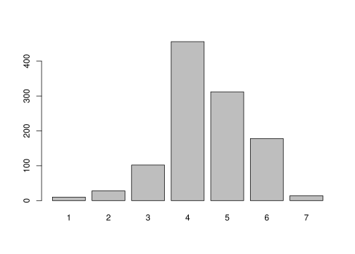

Set up
======

    rm(list=ls()) 
    set.seed(11) 
    library(BayesVarSel) 

    ## Loading required package: MASS

    ## Loading required package: mvtnorm

    ## Loading required package: parallel

    ## Loading required package: lmerTest

    ## Loading required package: lme4

    ## Loading required package: Matrix

    ## 
    ## Attaching package: 'lmerTest'

    ## The following object is masked from 'package:lme4':
    ## 
    ##     lmer

    ## The following object is masked from 'package:stats':
    ## 
    ##     step

    ## Warning: S3 method 'summary.BvsF' was declared in NAMESPACE but not found

    library(mixdir) 
    p=200 
    n=50 
    nsim.gibbs=10000 
    m1=3 
    signaltonoise=3 

Suppose we have 200 covariates and 50 iid observations from a regression
model where intercept and 197 coefficients are zero while the first 3
covariates are 3 and errors with variance 1.

    x=cbind(1,array(rnorm(n*p,0,1),dim=c(n,p))) 
    betas=c(0,c(1,1,1)*signaltonoise,rep(0,p-3)) 
    colnames(x)=c("I",paste("x",1:p,sep="")) 
    true.mod=(betas>0)*1 
    names(true.mod)=colnames(x) 
    y=x%*%betas+rnorm(n,0,1) 
    simdat=data.frame(y,x) 

Usual analysis with Gibbs sampling on model space.
==================================================

Suppose to explore the model space with 10^{4} steps using Gibbs
Sampling, starting from the full and assuming a constant prior on model
space (only to perform Gibb Sampling). BF factors are calculated using
the conventional prior.

    res.GibbsBvs<- GibbsBvs(formula= y ~ ., data=simdat, prior.betas="gZellner", 
                            prior.models="Constant", n.iter=nsim.gibbs, init.model="Null", n.burnin=100, 
                            time.test = FALSE)

    ## In this dataset n
n.
    ## Info. . . .
    ## Most complex model has 202 covariates
    ## From those 1 are fixed and we should select from the remaining 201 
    ## I, x1, x2, x3, x4, x5, x6, x7, x8, x9, x10, x11, x12, x13, x14, x15, x16, x17, x18, x19, x20, x21, x22, x23, x24, x25, x26, x27, x28, x29, x30, x31, x32, x33, x34, x35, x36, x37, x38, x39, x40, x41, x42, x43, x44, x45, x46, x47, x48, x49...
    ## The problem has a total of 3.213876e+60 competing models
    ## Of these, 10100 are sampled with replacement
    ## Then, 10000 are kept and used to construct the summaries
    ## Working on the problem...please wait.

From exploration steps we need at least the set of visited models in all
performed Gibbs steps (BFs are ignored). These are our observations.

    xx=res.GibbsBvs$modelslogBF 
    dim(xx) 

    ## [1] 10000   202

    ww=xx[,ncol(xx)] 
    xx=xx[,-ncol(xx)] 
    image(xx[,1:10]) 

This matrix is the of 0/1s that provides evidence for the true model
into a part of the model space. In this case the explored models have
the following sizes:

    barplot(table(rowSums(xx)),xlab="Model sizes")

A refinement using DPMP
=======================

Not all models into the model space can be visited, only those with
*p* − *n* − 1 covariates (149 in this case). The full model space is
given by the hyper contingency table made by crossing *p* 0/1
categorical variables with 2 levels and thus by 2*p* cells
(1.60693810^{60} in this case). On the probability distribution of such
contingency table we assume a Dirichlet process prior (which is the
prior on model space) and the data are the samples from Gibbs step. This
model is proposed here Dunson and Xing (2009).

    mdat=data.frame(xx) 
    for(i in 1:ncol(mdat)) mdat[,i]=factor(mdat[,i]) 

Posterior of cells probabilities (and thus models) is obtained using the
variational algorithm detailed in Ahlmann-Eltze and Yau (2018)
(otherwise Gibbs sampling would be used as originally proposed in Dunson
and Xing (2009)). We assume that the latent space has dimension 2: the
space with covariates with cells with high probabilities (in which it is
supposed to lie the true model) and the set of cells with low
probabilities (in which there is not the true model)

    res <- mixdir(mdat, n_latent=2,max_iter = 1000) 
    cat(res$converged,"\n") 

    ## TRUE

Given one of the latent spaces, each covariate has a probability to be 1
or 0 (i.e. included or not included in the model). Let’s analyse each
latent space separately:

The posterior probability of each covariate for the first latent space
is (first 3 covariates belong to this latent space with high
probability):

    pls1=unlist(lapply(res$category_prob,function(x) x[[1]][2])) 
    barplot(pls1[-1],col=c(rep(2,m1),rep(1,p-m1)),las=2,cex.axis=0.5,ylim=c(0,1)) 

The posterior probability of each covariate for the second latent space
(which represents the null model):

    pls2=unlist(lapply(res$category_prob,function(x) x[[2]][2])) 
    barplot(pls2[-1],col=c(rep(2,m1),rep(1,p-m1)),las=2,cex.axis=0.5,ylim=c(0,1)) 

Comparison among the two analysis
=================================

Let’s compare the posterior inclusion probability with just Gibbs
sampling with the posterior probability using the DPMP:

    exdetail=paste("nGiibsBVS=",nsim.gibbs,
                   " signaltonoise=",signaltonoise,sep="") 
    par(mfrow=c(2,1)) 
    barplot(pls1,col=true.mod+1, 
            main=exdetail, 
            ylab="Post. Prob. DMMP",ylim=c(0,1)) 
    barplot(res.GibbsBvs$inclprob,col=true.mod+1,
            ylab="Post. Inclusion Prob.",ylim=c(0,1)) 

    par(mfrow=c(1,1)) 
    plot(res.GibbsBvs$inclprob,pls1,col=true.mod+1,cex=1,pch=19, 
         xlab="Post. Inclusion Prob.",ylab="Post. Prob. DMMP",main=exdetail,ylim=c(0,1),xlim=c(0,1)) 
    points(res.GibbsBvs$inclprob[true.mod==1],pls1[true.mod==1],col=2,cex=1,pch=23) 
    abline(0,1,lty=2) 

Riboflavin Genomic Data
=======================

Consider the Riboflavin data set. Dataset of riboflavin production by
Bacillus subtilis containing *n* = 71 observations of *p* = 4088
predictors (gene expressions) and a one-dimensional response (riboflavin
production).

    library(hdi)

    ## Loading required package: scalreg

    ## Loading required package: lars

    ## Loaded lars 1.2

    data(riboflavin)
    dim(riboflavin)

    ## [1] 71  2

Analysis with Non-local prior and Gibbs sampling
------------------------------------------------

    library(mombf)

    ## Loading required package: ncvreg

    ## Loading required package: mgcv

    ## Loading required package: nlme

    ## 
    ## Attaching package: 'nlme'

    ## The following object is masked from 'package:lme4':
    ## 
    ##     lmList

    ## This is mgcv 1.8-31. For overview type 'help("mgcv-package")'.

    res.nonlocal<- modelSelection(y=riboflavin$y, x=riboflavin$x,
                           scale=T, center=T,burnin = 100,
                           niter = nsim.gibbs+100)

    ## Using default prior for continuous outcomes priorCoef=momprior(tau=0.348), priorVar=igprior(.01,.01)
    ## Greedy searching posterior mode... Done.
    ## Running Gibbs sampler.......... Done.

    res.nonlocal$margpp[res.nonlocal$margpp>.5]

    ##   YOAB_at 
    ## 0.9751944

Analysis with Conventional prior and Gibbs sampling
---------------------------------------------------

    res.conventional<- GibbsBvs(formula=y~., data=as.data.frame(cbind(y=riboflavin$y, riboflavin$x)),prior.betas = "gZellner",n.iter=nsim.gibbs+100, init.model="Null", n.burnin=100, time.test = FALSE)

    ## In this dataset n
n.
    ## Info. . . .
    ## Most complex model has 4089 covariates
    ## From those 1 are fixed and we should select from the remaining 4088 
    ## AADK_at, AAPA_at, ABFA_at, ABH_at, ABNA_at, ABRB_at, ACCA_at, ACCB_at, ACCC_at, ACDA_at, ACKA_at, ACOA_at, ACOB_at, ACOC_at, ACOL_at, ACOR_at, ACPA_at, ACSA_at, ACUA_at, ACUB_at, ACUC_at, ADAA_at, ADAB_at, ADDA_at, ADDB_at, ADEC_at, ADHA_at, ADHB_at, ADK_at, AHPC_at, AHPF_at, AHRC_at, ALAS_at, ALD_at, ALDX_at, ALDY_at, ALKA_at, ALSD_at, ALSR_at, ALSS_at, ALST_at, AMHX_at, AMPS_at, AMYC_at, AMYD_at, AMYE_at, AMYX_at, ANSA_at, ANSB_at, ANSR_at...
    ## The problem has a total of Inf competing models
    ## Of these, 10200 are sampled with replacement
    ## Then, 10100 are kept and used to construct the summaries
    ## Working on the problem...please wait.

    res.conventional$inclprob[res.conventional$inclprob>0.5]

    ##   YOAB_at 
<<<<<<< HEAD
    ## 0.9536634
=======
    ## 0.9632673
>>>>>>> 32f9bab110b76d573110a70d825e0a01997f4d16

Results with Dirichlet Process prior
------------------------------------

### Using Gibb sampling with non-local priors

Size of explored models

    nlp.gibbs=res.nonlocal$postSample
<<<<<<< HEAD
=======

    ## Loading required package: mombf

    ## Loading required package: ncvreg

    ## Loading required package: mgcv

    ## Loading required package: nlme

    ## 
    ## Attaching package: 'nlme'

    ## The following object is masked from 'package:lme4':
    ## 
    ##     lmList

    ## This is mgcv 1.8-31. For overview type 'help("mgcv-package")'.

>>>>>>> 32f9bab110b76d573110a70d825e0a01997f4d16
    nlp.gibbs=nlp.gibbs[,colSums(nlp.gibbs)>20]
    dim(nlp.gibbs)

    ## [1] 10000   549

    barplot(table(rowSums(nlp.gibbs)))

    res.nlp <- mixdir(nlp.gibbs, n_latent=2,max_iter = 1000)
    pls.nlp=unlist(lapply(res.nlp$category_prob,function(x) x[[1]][2]))
    cat(res.nlp$converged,"\n") 

    ## TRUE

    pls.nlp[pls.nlp>0.5]

    ## YOAB_at.1 
<<<<<<< HEAD
    ## 0.9754905
=======
    ## 0.9775354
>>>>>>> 32f9bab110b76d573110a70d825e0a01997f4d16

### Using Gibb sampling with conventional priors

Size of Explored Models

    conv.gibbs=res.conventional$modelslogBF[,-ncol(res.conventional$modelslogBF)]
    conv.gibbs=conv.gibbs[,colSums(conv.gibbs)>20]
    dim(conv.gibbs)

<<<<<<< HEAD
    ## [1] 10100   463
=======
    ## [1] 10100   453
>>>>>>> 32f9bab110b76d573110a70d825e0a01997f4d16

    barplot(table(rowSums(conv.gibbs)))

    res.conv <- mixdir(conv.gibbs, n_latent=2,max_iter = 1000)
    pls.conv=unlist(lapply(res.conv$category_prob,function(x) x[[1]][2]))
    cat(res.conv$converged,"\n") 

    ## TRUE

    pls.conv[pls.conv>0.5]

<<<<<<< HEAD
    ## YOAB_at.1 
    ## 0.9547888
=======
    ## YOAB_at.1 YXLE_at.1 
    ## 0.8783103 0.9999653
>>>>>>> 32f9bab110b76d573110a70d825e0a01997f4d16

References
==========

Ahlmann-Eltze, Constantin, and Christopher Yau. 2018. “MixDir: Scalable
Bayesian Clustering for High-Dimensional Categorical Data.” In *2018
Ieee 5th International Conference on Data Science and Advanced Analytics
(Dsaa)*, 526–39. IEEE.

Dunson, David B, and Chuanhua Xing. 2009. “Nonparametric Bayes Modeling
of Multivariate Categorical Data.” *Journal of the American Statistical
Association* 104 (487): 1042–51.
