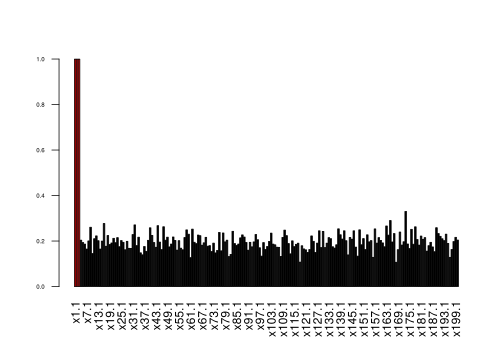

Set up
======

    rm(list=ls()) 
    set.seed(11) 
    library(BayesVarSel) 

    ## Loading required package: MASS

    ## Loading required package: mvtnorm

    ## Loading required package: parallel

    library(mixdir) 
    p=200 
    n=50 
    nsim.gibbs=10000 
    m1=3 
    signaltonoise=3 

Suppose we have 200 covariates and 50 iid observations from a regression
model where intercept and 197 coefficients are zero while the first 3
covariates are 3 and errors with variance 1.

    x=cbind(1,array(rnorm(n*p,0,1),dim=c(n,p))) 
    betas=c(0,c(1,1,1)*signaltonoise,rep(0,p-3)) 
    colnames(x)=c("I",paste("x",1:p,sep="")) 
    true.mod=(betas>0)*1 
    names(true.mod)=colnames(x) 
    y=x%*%betas+rnorm(n,0,1) 
    simdat=data.frame(y,x) 

Usual analysis with Gibbs sampling on model space.
==================================================

Suppose to explore the model space with 10^{4} steps using Gibbs
Sampling, starting from the full and assuming a constant prior on model
space (only to perform Gibb Sampling). BF factors are calculated using
the conventional prior.

    res.GibbsBvs<- GibbsBvs(formula= y ~ ., data=simdat, prior.betas="gZellner", 
                            prior.models="Constant", n.iter=nsim.gibbs, init.model="Null", n.burnin=100, 
                            time.test = FALSE)

    ## Info. . . .
    ## Most complex model has 202 covariates
    ## From those 1 is fixed and we should select from the remaining 201 
    ## I, x1, x2, x3, x4, x5, x6, x7, x8, x9, x10, x11, x12, x13, x14, x15, x16, x17, x18, x19, x20, x21, x22, x23, x24, x25, x26, x27, x28, x29, x30, x31, x32, x33, x34, x35, x36, x37, x38, x39, x40, x41, x42, x43, x44, x45, x46, x47, x48, x49, x50, x51, x52, x53, x54, x55, x56, x57, x58, x59, x60, x61, x62, x63, x64, x65, x66, x67, x68, x69, x70, x71, x72, x73, x74, x75, x76, x77, x78, x79, x80, x81, x82, x83, x84, x85, x86, x87, x88, x89, x90, x91, x92, x93, x94, x95, x96, x97, x98, x99, x100, x101, x102, x103, x104, x105, x106, x107, x108, x109, x110, x111, x112, x113, x114, x115, x116, x117, x118, x119, x120, x121, x122, x123, x124, x125, x126, x127, x128, x129, x130, x131, x132, x133, x134, x135, x136, x137, x138, x139, x140, x141, x142, x143, x144, x145, x146, x147, x148, x149, x150, x151, x152, x153, x154, x155, x156, x157, x158, x159, x160, x161, x162, x163, x164, x165, x166, x167, x168, x169, x170, x171, x172, x173, x174, x175, x176, x177, x178, x179, x180, x181, x182, x183, x184, x185, x186, x187, x188, x189, x190, x191, x192, x193, x194, x195, x196, x197, x198, x199, x200
    ## The problem has a total of 3.213876e+60 competing models
    ## Of these, 10100 are sampled with replacement
    ## Then, 10000 are kept and used to construct the summaries
    ## Working on the problem...please wait.

From exploration steps we need at least the set of visited models in all
performed Gibbs steps (BFs are ignored). These are our observations.

    xx=res.GibbsBvs$modelslogBF 
    dim(xx) 

    ## [1] 10000   202

    ww=xx[,ncol(xx)] 
    xx=xx[,-ncol(xx)] 
    image(xx[,1:10]) 

This matrix is the of 0/1s that provides evidence for the true model
into a part of the model space. In this case the explored models have
the following sizes:

    barplot(table(rowSums(xx)),xlab="Model sizes")

A refinement using DPMP
=======================

Not all models into the model space can be visited, only those with
*p* − *n* − 1 covariates (149 in this case). The full model space is
given by the hyper contingency table made by crossing *p* 0/1
categorical variables with 2 levels and thus by 2*p* cells
(1.60693810^{60} in this case). On the probability distribution of such
contingency table we assume a Dirichlet process prior (which is the
prior on model space) and the data are the samples from Gibbs step. This
model is proposed here Dunson and Xing (2009).

    mdat=data.frame(xx) 
    for(i in 1:ncol(mdat)) mdat[,i]=factor(mdat[,i]) 

Posterior of cells probabilities (and thus models) is obtained using the
variational algorithm detailed in Ahlmann-Eltze and Yau (2018)
(otherwise Gibbs sampling would be used as originally proposed in Dunson
and Xing (2009)). We assume that the latent space has dimension 2: the
space with covariates with cells with high probabilities (in which it is
supposed to lie the true model) and the set of cells with low
probabilities (in which there is not the true model)

    res <- mixdir(mdat, n_latent=2,max_iter = 1000) 
    cat(res$converged,"\n") 

    ## TRUE

Given one of the latent spaces, each covariate has a probability to be 1
or 0 (i.e. included or not included in the model). Let’s analyse each
latent space separately:

The posterior probability of each covariate for the first latent space
is (first 3 covariates belong to this latent space with high
probability):

    pls1=unlist(lapply(res$category_prob,function(x) x[[1]][2])) 
    barplot(pls1[-1],col=c(rep(2,m1),rep(1,p-m1)),las=2,cex.axis=0.5,ylim=c(0,1)) 

The posterior probability of each covariate for the second latent space
(which represents the null model):

    pls2=unlist(lapply(res$category_prob,function(x) x[[2]][2])) 
    barplot(pls2[-1],col=c(rep(2,m1),rep(1,p-m1)),las=2,cex.axis=0.5,ylim=c(0,1)) 

Comparison among the two analysis
=================================

Let’s compare the posterior inclusion probability with just Gibbs
sampling with the posterior probability using the DPMP:

    exdetail=paste("nGiibsBVS=",nsim.gibbs,
                   " signaltonoise=",signaltonoise,sep="") 
    par(mfrow=c(2,1)) 
    barplot(pls1,col=true.mod+1, 
            main=exdetail, 
            ylab="Post. Prob. DMMP",ylim=c(0,1)) 
    barplot(res.GibbsBvs$inclprob,col=true.mod+1,
            ylab="Post. Inclusion Prob.",ylim=c(0,1)) 

    par(mfrow=c(1,1)) 
    plot(res.GibbsBvs$inclprob,pls1,col=true.mod+1,cex=1,pch=19, 
         xlab="Post. Inclusion Prob.",ylab="Post. Prob. DMMP",main=exdetail,ylim=c(0,1),xlim=c(0,1)) 
    points(res.GibbsBvs$inclprob[true.mod==1],pls1[true.mod==1],col=2,cex=1,pch=23) 
    abline(0,1,lty=2) 

Riboflavin Genomic Data
=======================

Consider the Riboflavin data set. Dataset of riboflavin production by
Bacillus subtilis containing *n* = 71 observations of *p* = 4088
predictors (gene expressions) and a one-dimensional response (riboflavin
production).

    library(hdi)

    ## Loading required package: scalreg

    ## Loading required package: lars

    ## Loaded lars 1.2

    data(riboflavin)
    dim(riboflavin)

    ## [1] 71  2

Analysis with Non-local prior and Gibbs sampling
------------------------------------------------

    library(mombf)

    ## Loading required package: ncvreg

    ## Loading required package: mgcv

    ## Loading required package: nlme

    ## This is mgcv 1.8-31. For overview type 'help("mgcv-package")'.

    res.nonlocal<- modelSelection(y=riboflavin$y, x=riboflavin$x,
                           scale=T, center=T,burnin = 100,
                           niter = nsim.gibbs+100)

    ## Using default prior for continuous outcomes priorCoef=momprior(tau=0.348), priorVar=igprior(.01,.01)
    ## Greedy searching posterior mode... Done.
    ## Running Gibbs sampler.......... Done.

    res.nonlocal$margpp[res.nonlocal$margpp>.5]

    ##   YOAB_at 
    ## 0.9751944

Analysis with Conventional prior and Gibbs sampling
---------------------------------------------------

    res.conventional<- GibbsBvs(formula=y~., data=as.data.frame(cbind(y=riboflavin$y, riboflavin$x)),prior.betas = "gZellner",n.iter=nsim.gibbs+100, init.model="Null", n.burnin=100, time.test = FALSE)

    ## Info. . . .
    ## Most complex model has 4089 covariates
    ## From those 1 is fixed and we should select from the remaining 4088 
    ## AADK_at, AAPA_at, ABFA_at, ABH_at, ABNA_at, ABRB_at, ACCA_at, ACCB_at, ACCC_at, ACDA_at, ACKA_at, ACOA_at, ACOB_at, ACOC_at, ACOL_at, ACOR_at, ACPA_at, ACSA_at, ACUA_at, ACUB_at, ACUC_at, ADAA_at, ADAB_at, ADDA_at, ADDB_at, ADEC_at, ADHA_at, ADHB_at, ADK_at, AHPC_at, AHPF_at, AHRC_at, ALAS_at, ALD_at, ALDX_at, ALDY_at, ALKA_at, ALSD_at, ALSR_at, ALSS_at, ALST_at, AMHX_at, AMPS_at, AMYC_at, AMYD_at, AMYE_at, AMYX_at, ANSA_at, ANSB_at, ANSR_at, APPA_at, APPB_at, APPC_at, APPD_at, APPF_at, APRE_at, APRX_at, APT_at, ARAA_at, ARAB_at, ARAD_at, ARAE_at, ARAL_at, ARAM_at, ARAN_at, ARAP_at, ARAQ_at, ARAR_at, ARGB_at, ARGC_at, ARGD_at, ARGE_at, ARGF_at, ARGG_at, ARGH_at, ARGJ_at, ARGS_at, AROA_at, AROB_at, AROC_at, AROD_at, AROE_at, AROF_at, AROH_at, AROI_at, arsB_at, arsC_at, arsR_at, ASD_at, ASK_r_at, ASNB_at, ASNH_at, ASNS_at, ASPB_at, ASPS_at, ATPA_at, ATPB_at, ATPC_at, ATPD_at, ATPE_at, ATPF_at, ATPG_at, ATPH_at, ATPI_at, AZLB_at, AZLC_at, AZLD_at, bcd_at, BCSA_at, BEX_at, BFMBAA_at, BFMBAB_at, BFMBB_at, BGLA_at, BGLC_at, BGLH_at, BGLP_at, BGLS_at, bhlA_i_at, bhlB_at, BIOA_at, BIOB_at, BIOD_at, BIOF_at, BIOI_at, BIOW_at, BIRA_s_at, bkdR_at, BLT_at, BLTD_at, BLTR_at, blyA_at, BMR_at, BMRR_at, BMRU_at, BOFA_at, BOFC_at, BPR_at, BRAB_at, BRNQ_at, BSAA_at, CAH_at, CARA_at, CARB_at, cca_at, CCCA_at, CCCB_at, CCDA_at, CCPA_at, ccpB_at, CDD_at, CDSA_at, CGEA_at, CGEB_at, CGEC_at, CGED_at, CGEE_at, CHEA_at, CHEB_at, CHEC_at, CHED_at, CHER_at, CHEV_at, CHEW_at, CHEY_at, CINA_at, CITA_at, CITB_at, CITC_at, CITG_at, CITH_at, CITM_at, CITR_at, CITS_at, CITT_at, CITZ_at, CLPC_at, CLPE_at, CLPP_at, CLPQ_at, CLPX_at, CLPY_at, CMK_at, CODV_at, CODY_at, COMA_at, COMC_at, COMEA_at, COMEB_at, COMEC_at, COMER_at, COMFA_at, COMFB_at, COMFC_at, COMGA_at, COMGB_at, COMGC_at, COMGD_at, COMGE_at, COMGF_at, COMGG_at, COMK_at, COMP_at, COMQ_at, COMX_at, COTA_at, COTB_at, COTC_i_at, COTD_at, COTE_at, COTF_at, COTG_at, COTH_at, COTJA_at, COTJB_at, COTJC_at, COTK_at, COTL_r_at, COTM_at, cotSA_at, COTS_at, COTT_at, COTV_at, COTW_at, COTX_at, COTY_at, COTZ_at, CRH_at, CSAA_at, CSBA_at, CSBB_at, csbC_at, csbD_i_at, CSBX_at, CSFB_i_at, CSGA_at, CSN_at, CSPB_at, CSPC_at, CSPD_at, CSPR_at, CSRA_at, CSTA_at, CTAA_at, CTAB_at, CTAC_at, CTAD_at, CTAE_at, CTAF_at, CTAG_at, CTC_at, CTPA_at, CTRA_at, CTSR_at, CWLA_at, CWLC_at, CWLD_at, CWLJ_at, CYDA_at, CYDB_at, CYDC_at, CYDD_at, CYPA_at, CYPX_at, CYSE_at, CYSH_at, CYSK_at, CYSS_at, CZCD_at, DACA_at, DACB_at, dacC_at, DACF_at, DAL_at, DAPA_at, DAPB_at, DAPG_at, DAT_at, DDLA_at, DEAD_at, DEF_at, DEGA_at, DEGQ_r_at, DEGR_r_at, DEGS_at, DEGU_at, DEOD_at, DEOR_at, des_at, DFRA_at, DGKA_at, DHAS_at, DHBA_at, DHBB_at, DHBC_at, DHBE_at, DHBF_at, DINB_at, DING_at, DIVIB_at, DIVIC_at, DIVIVA_at, DLTA_at, DLTB_at, DLTC_at, DLTD_at, DLTE_at, DNAA_at, DNAB_at, DNAC_at, DNAD_at, DNAE_at, DNAG_at, DNAI_at, DNAJ_at, DNAK_at, DNAN_at, DNAX_at, DPPA_at, DPPB_at, DPPC_at, DPPD_at, DPPE_at, DPS_at, DRA_at, DRM_at, EAG_at, EBRA_at, EBRB_at, ECSA_at, ECSB_at, ECSC_at, EFP_at, ENO_at, EPR_at, ETFA_at, ETFB_at, EXOA_at, EXPZ_at, exuR_at, exuT_at, FABD_at, FABG_at, FBAA_at, FBP_at, FER_at, FEUA_at, FEUB_at, FEUC_at, FFH_at, FHUB_at, FHUC_at, FHUD_at, FHUG_at, FLGB_at, FLGC_at, FLGE_at, FLGK_at, FLGL_at, FLGM_at, FLHA_at, FLHB_at, FLHF_at, FLHO_at, FLHP_at, FLID_at, FLIE_at, FLIF_at, FLIG_at, FLIH_at, FLII_at, FLIJ_at, FLIK_at, FLIL_at, FLIM_at, FLIP_at, FLIQ_at, FLIR_at, FLIS_at, FLIT_at, FLIY_at, FLIZ_at, FMT_at, FNR_at, FOLA_at, FOLC_at, FOLD_at, FOLK_at, FRR_at, FRUA_at, FRUB_at, FRUR_at, FTSA_at, FTSE_at, FTSH_at, FTSL_at, FTSX_at, FTSY_at, FTSZ_at, fur_at, FUS_at, GABP_at, GALE_at, GALK_at, GALT_at, `GAP129A-F_at`, `GAP136-F_at`, `GAP181-F_at`, `GAP229-F_at`, `GAP275-R_at`, `GAP317-F_at`, `GAP68D-R_at`, `GAP83-R_at`, GAP_at, GAPB_at, gatA_at, gatB_at, gatC_at, GBSA_at, GBSB_at, GCAD_at, GDH_at, GERAA_at, GERAB_at, GERAC_at, GERBA_at, GERBB_at, GERBC_at, GERCA_at, GERCB_at, GERCC_at, GERD_at, GERE_at, GERKA_at, GERKB_at, GERKC_at, GERM_at, GGAA_at, GGAB_at, GGT_at, GIDA_at, GID_at, GIDB_at, GLCK_at, glcP_at, GLCR_at, GLCT_at, GLGA_at, GLGB_at, GLGC_at, GLGD_at, GLGP_at, GLMS_at, GLNA_at, GLNH_at, GLNM_at, GLNP_at, GLNQ_at, GLNR_at, GLPD_at, GLPF_at, GLPK_at, GLPP_at, GLPQ_at, GLPT_at, GLTA_at, GLTB_at, GLTC_at, GLTP_at, GLTR_at, GLTT_at, GLTX_at, GLVA_at, GLVC_at, GLYA_at, GLYQ_at, GLYS_at, GNTK_at, GNTP_at, GNTR_at, GNTZ_at, goxB_at, GPR_at, GPSA_at, GREA_at, GROEL_at, GROES_at, GRPE_at, GSAB_at, GSIB_at, GSPA_at, GTAB_at, GUAA_at, GUAB_at, gudB_at, GUTB_at, GUTR_at, GYRA_at, GYRB_at, HAG_at, HBS_at, HEMA_at, HEMB_at, HEMC_at, HEMD_at, HEME_at, HEMH_at, HEML_at, HEMN_at, HEMX_at, HEMY_at, HIPO_at, HISA_at, HISB_at, HISC_at, HISD_at, HISF_at, HISG_at, HISH_at, HISI_at, hisJ_at, HISP_at, HISS_at, HISZ_at, HIT_at, HMP_at, HOLB_at, HOM_at, HPR_at, hprK_at, hprP_at, HPRT_at, HRCA_at, HTPG_at, HTRA_at, HUTG_at, HUTH_at, HUTI_at, HUTM_at, HUTP_at, HUTU_at, ILES_at, ILVA_at, ILVB_at, ILVC_at, ILVD_at, ILVN_at, INFA_at, INFB_at, INFC_at, IOLA_at, IOLB_at, IOLC_at, IOLD_at, IOLE_at, IOLF_at, IOLG_at, IOLH_at, IOLI_at, IOLJ_at, IOLR_at, IOLS_at, IPI_at, ISPA_at, ISPU_at, JAG_at, KAPB_at, KAPD_at, KATA_at, KATB_at, KATX_at, KBAA_at, KBL_at, KDGA_at, KDGK_at, KDGR_at, KDGT_at, KDUD_at, KDUI_at, KINA_at, KINB_at, KINC_at, kipR_at, KSGA_at, LACA_at, LACR_at, LCFA_at, LCTE_at, LCTP_at, LEPA_at, LEUA_at, LEUB_at, LEUC_at, LEUD_at, LEUS_at, LEVD_at, LEVE_at, LEVF_at, LEVG_at, LEVR_at, LEXA_at, LGT_at, LICA_at, LICB_at, LICC_at, LICH_at, LICR_at, LICT_at, LIPA_at, LIPB_at, LMRA_at, LMRB_at, LONA_at, LONB_at, LPLA_at, LPLB_at, LPLC_at, LPLD_at, LRPA_at, LRPB_at, LRPC_at, LSP_at, LYSA_at, LYSC_at, LYSS_at, LYTA_at, LYTB_at, LYTC_at, LYTD_at, LYTE_at, lytF_at, LYTR_at, LYTS_at, LYTT_at, MAF_at, malL_at, MALS_at, MAP_at, MBL_at, MCPA_at, MCPB_at, MCPC_at, MDR_at, MECA_at, MED_at, MELA_at, MENB_at, menC_at, MEND_at, MENE_at, MENF_at, METB_at, METC_at, METK_at, METS_at, MFD_at, MIAA_at, MINC_at, MIND_at, MMGA_at, MMGB_at, MMGC_at, MMGD_at, MMGE_at, MMR_at, MOAB_at, MOAD_at, MOAE_at, MOBA_at, MOBB_at, MOEA_at, MOEB_at, MOTA_at, MOTB_at, MPR_at, MRAY_at, MREB_at, MREBH_at, MREC_at, MRED_at, MRGA_at, mrpA_at, mrpB_at, mrpC_at, mrpD_at, mrpF_at, mrpG_at, MSME_at, MSMR_at, MSMX_at, msrA_at, MTA_at, MTBP_at, MTLA_at, MTLD_at, MTRA_at, MTRB_at, MURA_at, MURB_at, MURC_at, MURD_at, MURE_at, MURF_at, MURG_at, MURZ_at, MUTL_at, MUTM_at, MUTS_at, MUTT_at, NADA_at, NADB_at, NADC_at, NADE_at, NAGA_at, NAGB_at, NAP_at, NARA_at, NARG_at, NARH_at, NARI_at, NARJ_at, NARK_at, NARQ_at, NASA_at, NASB_at, NASC_at, NASD_at, NASE_at, NASF_at, NATA_at, NATB_at, NDHF_at, NDK_at, nfrA_at, NIFS_at, NIFZ_at, NIN_at, NPRB_at, NPRE_at, NRDE_at, NRDF_at, NRGA_at, NRGB_at, NTH_at, NUCA_at, NUCB_at, NUPC_at, NUSA_at, NUSG_at, OBG_s_at, ODHA_at, ODHB_at, OPPA_at, OPPB_at, OPPC_at, OPPD_at, OPPF_at, OPUAA_at, OPUAB_at, OPUAC_at, OPUBA_at, OPUBB_at, OPUBC_at, OPUBD_at, OPUCA_at, OPUCB_at, OPUCC_at, OPUCD_at, OPUD_at, OPUE_at, PABA_at, PABB_at, PABC_at, PADC_at, PAIA_at, PAIB_at, PANB_at, PANC_at, PAND_at, parC_at, parE_at, PATA_at, PATB_at, PBPA_at, PBPB_at, PBPC_at, PBPD_at, PBPE_at, PBPF_at, PBPX_at, PBUX_at, PCKA_at, PCP_at, pcrA_at, PDHA_at, PDHB_at, PDHC_at, PDHD_at, PDP_at, PEL_at, PELB_at, PENP_at, PEPT_at, perR_at, PFK_at, PGI_at, PGK_at, PGM_at, PGSA_at, PHEA_s_at, PHEB_s_at, PHES_at, PHET_at, PHOA_at, PHOB_at, PHOD_at, PHOH_at, PHOP_at, PHOR_at, PHRA_at, PHRC_at, PHRE_at, PHRF_at, PHRG_i_at, PHRI_r_at, PHRK_at, PKSA_at, PKSB_at, PKSC_at, PKSD_at, PKSE_at, PKSF_at, PKSG_at, PKSH_at, PKSI_at, PKSJ_at, PKSL_at, PKSM_at, PKSN_at, PKSR_at, PKSS_at, PLSX_at, PMI_at, PNBA_at, PNPA_at, PNP_at, POLA_at, POLC_at, PONA_at, PPIB_at, PPSA_at, PPS_at, PPSB_at, PPSC_at, PPSD_at, PPSE_at, PRFA_at, PRFB_at, PRIA_at, PRKA_at, PROA_at, PROB_at, PROH_at, PROJ_at, PROS_at, PRSA_at, PRS_at, PSD_at, PSSA_at, PTA_at, PTSG_at, PTSH_at, PTSI_at, PURA_at, PURB_at, PURC_at, PURD_at, PURE_at, PURF_at, PURH_at, PURK_at, PURL_at, PURM_at, PURN_at, PURQ_at, PURR_at, PURT_at, PYCA_at, PYKA_at, PYRAA_at, PYRAB_at, PYRB_at, PYRC_at, PYRD_at, PYRDII_at, PYRE_at, PYRF_at, PYRP_at, PYRR_at, QCRA_at, QCRB_at, QCRC_at, QOXA_at, QOXB_at, QOXC_at, QOXD_at, QUEA_at, RACE_at, RACX_at, RAPA_at, RAPB_at, RAPC_at, RAPD_at, RAPE_at, RAPF_at, RAPG_at, RAPH_at, RAPI_at, RAPJ_at, RAPK_at, RBFA_at, RBSA_at, RBSB_at, RBSC_at, RBSD_at, RBSK_at, RBSR_at, RECA_at, RECF_at, RECN_at, recO_at, RECR_at, recS_at, recU_at, RELA_at, RESA_at, RESB_at, RESC_at, RESD_at, RESE_at, RHO_at, RIBA_at, RIBB_at, RIBC_at, RIBG_at, RIBH_at, RIBR_at, RIBT_at, RIPX_at, rluB_at, RNCS_at, rnhB_at, rnhC_at, RNPA_at, ROCA_at, ROCB_at, ROCC_at, ROCD_at, ROCE_at, ROCF_at, rocG_at, ROCR_at, rodA_at, RPH_at, RPLA_at, RPLB_at, RPLC_at, RPLD_at, RPLE_at, RPLF_at, RPLI_at, RPLJ_at, RPLK_at, RPLL_at, RPLM_at, RPLN_at, RPLO_at, RPLP_at, RPLQ_at, RPLR_at, RPLS_at, RPLT_at, RPLU_at, RPLV_at, RPLW_at, RPLX_at, RPMA_at, RPMB_at, RPMC_at, RPMD_at, RPME_at, RPMF_at, RPMG_at, RPMH_at, RPMI_at, RPMJ_i_at, RPOA_at, RPOB_at, RPOC_at, RPOE_at, RPSB_at, RPSC_at, RPSD_at, RPSE_at, RPSF_at, RPSG_at, RPSH_at, RPSI_at, RPSJ_at, RPSK_at, RPSL_at, RPSM_at, RPSN_at, RPSO_at, RPSP_at, RPSQ_at, RPSR_at, RPSS_at, RPST_at, RPSU_at, RSBR_at, RSBS_at, RSBT_at, RSBU_at, RSBV_at, RSBW_at, RSBX_at, rsiX_at, RTP_at, RUVA_at, RUVB_at, SACA_at, SACB_at, SACC_at, SACP_at, SACT_at, SACV_r_at, SACX_at, SACY_at, SAPB_at, SBCD_at, SBO_at, SBP_at, SDHA_at, SDHB_at, SDHC_at, SECA_at, SECE_r_at, SECF_at, secG_at, SECY_at, SENS_at, SERA_at, SERC_at, SERS_at, SFP_at, SIGA_at, SIGB_at, SIGD_at, SIGE_at, SIGF_at, SIGG_at, SIGH_at, SIGL_at, sigM_at, SIGV_at, SIGW_at, SIGX_at, SIGY_at, SIGZ_at, SINI_at, SINR_at, SIPS_at, SIPT_at, SIPU_at, SIPV_at, SIPW_at, SLEB_at, SLP_at, SLR_at, SMBA_at, SMC_at, SMF_at, SMS_at, SODA_at, SODF_at, SOJ_at, speA_at, speB_at, speE_at, SPLA_at, SPLB_at, SPMA_at, SPMB_at, SPO0A_at, SPO0B_s_at, SPO0E_at, SPO0F_at, SPO0J_at, spo0M_at, SPOIIAA_at, SPOIIAB_at, SPOIIB_at, SPOIID_at, SPOIIE_at, SPOIIGA_at, SPOIIIAA_at, SPOIIIAB_at, SPOIIIAC_at, SPOIIIAD_at, SPOIIIAE_at, SPOIIIAF_at, SPOIIIAG_at, SPOIIIAH_at, SPOIIIC_at, SPOIIID_at, SPOIIIE_at, SPOIIIJ_at, SPOIIM_at, SPOIIP_at, SPOIIQ_at, SPOIIR_at, SPOIISA_at, SPOIISB_at, SPOIVA_at, SPOIVB_at, SPOIVCA_at, SPOIVCB_at, SPOIVFA_at, SPOIVFB_at, SPOVAA_at, SPOVAB_at, SPOVAC_at, SPOVAD_at, SPOVAE_at, SPOVAF_at, SPOVB_at, SPOVC_at, SPOVD_at, SPOVE_at, SPOVFA_at, SPOVFB_at, SPOVG_at, SPOVID_at, SPOVK_at, SPOVM_r_at, SPOVR_at, SPOVS_at, SPOVT_at, SPSA_at, SPSB_at, SPSC_at, SPSD_at, SPSE_at, SPSF_at, SPSG_at, SPSI_at, SPSJ_at, SQHC_at, SRFAA_at, SRFAB_at, SRFAC_at, SRFAD_at, SSB_at, SSPA_at, SSPB_at, SSPC_at, SSPD_at, SSPE_at, SSPF_at, sspG_at, sspH_at, sspI_at, sspJ_at, sspK_at, sspL_at, sspM_r_at, sspN_at, ssuA_at, ssuB_at, ssuC_at, ssuD_at, SUCC_at, SUCD_at, SUL_at, SUNA_at, SUNT_at, TAGA_at, TAGB_at, TAGC_at, TAGD_at, TAGE_at, TAGF_at, TAGG_at, TAGH_at, TAGO_at, tasA_at, TDH_at, TDK_at, TENA_at, TENI_at, TETB_at, TETL_n_at, TGL_at, TGT_at, THDF_at, THIA_at, THIC_at, THID_at, THIK_at, THRB_s_at, THRC_s_at, THRS_at, THRZ_at, THYA_at, THYB_at, TIG_at, TKT_at, TLPA_at, TLP_at, TLPB_at, TLPC_at, TMK_at, TMRB_at, TNRA_at, TOPA_at, TOPB_at, TPI_at, TREA_at, TREP_at, TRER_at, TRKA_at, TRMD_at, TRPA_at, TRPB_at, TRPD_s_at, TRPE_at, TRPS_at, TRUA_at, TRUB_at, TRXA_at, TRXB_at, TSF_at, TUAA_at, TUAB_at, TUAC_at, TUAD_at, TUAE_at, TUAF_at, TUAG_at, TUAH_at, TUFA_at, TYRA_at, TYRS_at, TYRZ_at, UDK_at, UNG_at, UPP_at, UREA_at, UREB_at, UREC_at, USD_i_at, UVRA_at, UVRB_at, UVRC_at, UVRX_at, UVRX_g_at, uxaA_at, uxaB_at, uxaC_at, uxuA_at, VALS_at, VEG_at, VPR_at, WAPA_at, WPRA_at, xepA_at, XHLA_at, XHLB_at, XKDA_at, XKDB_at, XKDC_at, XKDD_at, XKDE_at, XKDF_at, XKDG_at, XKDH_at, XKDI_at, XKDJ_at, XKDK_at, XKDM_at, XKDN_at, XKDO_at, XKDP_at, XKDQ_at, XKDR_at, XKDS_at, XKDT_at, XKDU_at, XKDV_at, XKDW_at, XKDX_at, XLYA_at, XLYB_at, XPAC_at, XPF_at, XPT_at, XRE_at, XSA_at, XTMA_at, XTMB_at, XTRA_at, XYLA_at, XYLB_at, XYLR_at, XYNA_at, XYNB_at, XYND_at, YAAA_at, YAAB_at, YAAC_at, YAAD_at, YAAE_at, YAAF_at, YAAG_at, YAAH_at, YAAI_at, YAAJ_at, YAAK_at, YAAL_at, YAAN_at, YAAO_at, YAAQ_at, YAAR_at, YAAT_at, YABA_at, YABB_at, YABC_at, YABD_at, YABE_at, YABF_at, YABG_at, YABH_at, YABJ_at, YABK_at, YABM_at, YABN_at, YABO_at, YABP_at, YABQ_at, YABR_at, YABS_at, YABT_at, YACA_at, YACB_at, YACC_at, YACD_at, YACF_at, YACH_at, YACI_at, YACK_at, YACL_at, YACM_at, YACN_at, YACO_at, YACP_at, YAZA_at, YAZB_at, YAZC_at, YBAC_at, YBAE_at, YBAF_at, YBAJ_at, YBAK_at, YBAL_at, YBAN_at, YBAR_at, YBAS_at, YBBA_at, YBBB_at, YBBC_at, YBBD_at, YBBE_at, YBBF_at, YBBH_at, YBBI_at, YBBJ_at, YBBK_at, YBBM_at, YBBP_at, YBBR_at, YBBT_at, YBBU_at, YBCC_at, YBCD_at, YBCF_at, YBCH_at, YBCI_at, YBCL_at, YBCM_at, YBCO_at, YBCP_at, YBCS_at, YBCT_at, YBDA_at, YBDB_at, YBDD_at, YBDE_at, YBDG_at, YBDJ_at, YBDK_at, YBDL_at, YBDM_at, YBDN_at, YBDO_at, YBDT_at, YBEC_at, YBEF_at, YBFA_at, YBFB_at, YBFE_at, YBFF_at, YBFG_at, YBFH_at, YBFI_at, YBFJ_at, YBFK_at, YBFM_at, YBFN_at, YBFO_at, YBFP_at, YBFQ_at, YBFS_at, YBFT_at, YBGA_at, YBGB_at, YBGE_at, YBGF_at, YBGG_at, YBGH_at, YBGJ_at, YBXA_at, YBXB_at, YBXF_at, YBXG_at, YBXH_at, YBXI_at, YBYB_at, YCBA_at, YCBB_at, YCBC_at, YCBD_at, YCBE_at, YCBF_at, YCBG_at, YCBH_at, YCBJ_at, YCBK_at, YCBL_at, YCBM_at, YCBN_at, YCBO_at, YCBP_at, YCBR_at, YCBT_at, YCBU_at, YCCC_at, YCCF_at, YCCG_at, YCCH_at, YCCK_at, YCDA_at, YCDB_at, YCDC_at, YCDD_at, YCDF_at, YCDG_at, YCDH_at, YCDI_at, YCEA_at, YCEB_at, YCEC_at, YCED_at, YCEE_at, YCEF_at, YCEG_at, YCEH_at, YCEI_at, YCEJ_at, YCEK_at, YCGA_at, YCGB_at, YCGE_at, YCGF_at, YCGG_at, YCGH_at, YCGI_at, YCGJ_at, YCGK_at, YCGL_at, YCGM_at, YCGN_at, YCGO_at, YCGP_at, YCGQ_at, YCGR_at, YCGS_at, YCGT_at, YCIA_at, YCIB_at, YCIC_at, YCKA_at, YCKB_at, YCKC_at, YCKD_at, YCKE_at, YCKF_at, YCKG_at, YCKH_at, YCKI_at, YCKJ_at, YCKK_at, YCLA_at, YCLB_at, YCLC_at, YCLD_at, YCLE_at, YCLF_at, YCLG_at, YCLH_at, YCLI_at, YCLJ_at, YCLK_at, YCLM_at, YCLN_at, YCLO_at, YCLP_at, YCLQ_at, YCNB_at, YCNC_at, YCND_at, YCNE_at, YCNF_at, YCNG_at, YCNH_at, YCNI_at, YCNJ_at, YCNK_at, YCNL_at, YCSA_at, YCSD_at, YCSE_at, YCSF_at, YCSG_at, YCSI_at, YCSK_at, YCSN_at, YCXA_at, YCXB_at, YCXC_at, YCXD_at, YCXE_at, YCZA_at, YCZB_at, YCZC_at, YCZE_at, YCZF_at, YCZG_at, YCZH_at, YCZI_at, YCZJ_at, YDAA_at, YDAB_at, YDAC_at, YDAD_at, YDAE_at, YDAF_at, YDAG_at, YDAH_at, YDAJ_at, YDAK_at, YDAL_at, YDAM_at, YDAN_at, YDAO_at, YDAP_at, YDAQ_at, YDAR_at, YDAS_at, YDAT_at, YDBA_at, YDBB_at, YDBC_at, YDBD_at, YDBE_at, YDBF_at, YDBG_at, YDBH_at, YDBI_at, YDBJ_at, YDBK_at, YDBL_at, YDBM_at, YDBN_at, YDBO_at, YDBP_at, YDBR_at, YDBS_at, YDBT_at, YDCA_at, YDCB_at, YDCC_at, YDCD_at, YDCE_at, YDCF_at, YDCG_at, YDCH_at, YDCI_at, YDCK_at, YDCL_at, YDCM_at, YDCN_at, YDCO_at, YDCP_at, YDCQ_at, YDCR_at, YDCS_at, YDCT_at, YDDA_at, YDDB_at, YDDC_at, YDDD_at, YDDE_at, YDDF_at, YDDG_at, YDDH_at, YDDI_at, YDDJ_r_at, YDDK_at, YDDM_at, YDDN_at, YDDQ_at, YDDR_at, YDDS_at, YDDT_s_at, YDEA_at, YDEB_at, YDEC_at, YDED_at, YDEE_at, YDEF_at, YDEG_at, YDEH_at, YDEI_at, YDEJ_at, YDEK_at, YDEL_at, YDEM_at, YDEN_at, YDEO_at, YDEP_at, YDEQ_at, YDER_at, YDES_at, YDET_at, YDFA_at, YDFB_at, YDFC_at, YDFD_at, YDFE_at, YDFF_at, YDFG_at, YDFH_at, YDFI_at, YDFJ_at, YDFK_at, YDFL_at, YDFM_at, YDFN_at, YDFO_at, YDFP_at, YDFQ_at, YDFR_at, YDFS_at, YDFT_at, YDGA_at, YDGB_at, YDGC_at, YDGD_at, YDGE_at, YDGF_at, YDGG_at, YDGH_at, YDGI_at, YDGJ_at, YDGK_at, YDHB_at, YDHC_at, YDHD_at, YDHE_at, YDHF_at, YDHG_at, YDHH_at, YDHI_at, YDHJ_at, YDHK_at, YDHL_at, YDHM_at, YDHN_at, YDHO_at, YDHP_at, YDHQ_at, YDHR_at, YDHS_at, YDHT_at, YDHU_at, YDIA_at, YDIB_at, YDIC_at, YDID_at, YDIE_at, YDIF_at, YDIG_at, YDIH_at, YDII_at, YDIJ_at, YDIK_at, YDIL_at, YDIM_at, YDIN_r_at, YDIO_at, YDIP_at, YDIQ_at, YDIR_at, YDIS_at, YDJA_at, YDJB_at, YDJC_at, YDJD_at, YDJE_at, YDJF_at, YDJG_at, YDJH_at, YDJI_at, YDJJ_at, YDJK_at, YDJL_at, YDJM_at, YDJN_at, YDJO_at, YDJP_at, YDZA_at, YDZE_at, YDZF_at, YDZH_at, YEAA_at, YEAB_at, YEAC_at, YEAD_at, YEBA_at, YEBB_at, YEBC_at, YEBD_at, YEBF_at, YEBG_at, YECA_at, YEEA_at, YEEB_at, YEEC_at, YEED_at, YEEF_at, YEEG_at, YEEI_at, YEFA_at, YEFB_at, YEFC_at, YERA_at, YERB_at, YERC_at, YERD_at, YERE_at, YERG_at, YERH_at, YERI_at, YERO_at, YERP_at, YERQ_at, YESE_at, YESF_at, YESJ_at, YESK_at, YESL_at, YESM_at, YESN_at, YESO_at, YESP_at, YESQ_at, YESR_at, YESS_at, YEST_at, YESU_at, YESV_at, YESW_at, YESX_at, YESY_at, YESZ_at, YETA_at, YETF_at, YETG_at, YETH_at, YETI_at, YETJ_at, YETK_at, YETL_at, YETM_at, YETN_at, YETO_at, YEXA_at, YEZA_at, YEZB_at, YEZC_at, YEZD_at, YFHA_at, YFHB_at, YFHC_at, YFHD_at, YFHE_r_at, YFHF_at, YFHG_at, YFHH_at, YFHI_at, YFHJ_at, YFHK_at, YFHL_at, YFHM_at, YFHO_at, YFHP_at, YFHQ_at, YFHR_at, YFHS_i_at, YFIA_at, YFIB_at, YFIC_at, YFID_at, YFIE_at, YFIF_at, YFIG_at, YFIH_at, YFII_at, YFIJ_at, YFIK_at, YFIL_at, YFIM_at, YFIN_at, YFIO_at, YFIQ_at, YFIR_at, YFIS_at, YFIT_at, YFIU_at, YFIV_at, YFIW_at, YFIX_at, YFIY_at, YFIZ_at, YFJA_at, YFJB_at, YFJC_at, YFJD_at, YFJE_at, YFJF_at, YFJL_at, YFJM_at, YFJN_at, YFJO_at, YFJP_at, YFJQ_at, YFJR_at, YFJS_at, YFJT_at, YFKA_at, YFKB_at, YFKC_at, YFKD_at, YFKE_at, YFKF_at, YFKH_at, YFKI_at, YFKJ_at, YFKK_at, YFKL_at, YFKM_at, YFKN_at, YFKO_at, YFKQ_at, YFKR_at, YFKS_at, YFKT_at, YFLA_at, YFLB_at, YFLC_at, YFLD_r_at, YFLE_at, YFLF_at, YFLG_at, YFLH_at, YFLI_at, YFLJ_i_at, YFLK_at, YFLL_at, YFLM_at, YFLN_at, YFLP_at, YFLS_at, YFLT_at, YFMA_at, YFMB_at, YFMC_at, YFMD_at, YFME_at, YFMF_at, YFMG_at, YFMH_r_at, YFMI_at, YFMJ_at, YFMK_at, YFML_at, YFMM_at, YFMN_at, YFMO_at, YFMP_at, YFMQ_at, YFMR_at, YFMS_at, YFMT_at, YFNA_at, YFNB_at, YFNC_at, YFND_at, YFNE_at, YFNF_at, YFNG_at, YFNH_at, YFNI_at, YGAB_at, YGAC_at, YGAD_at, YGAE_at, YGAF_at, YGAJ_at, YGAK_at, YGAN_at, YGAO_at, YGXA_at, YGXB_at, YGZA_at, YHAA_at, YHAG_at, YHAH_at, YHAI_at, YHAJ_at, YHAK_at, YHAL_at, YHAM_at, YHAN_at, YHAO_at, YHAP_at, YHAQ_at, YHAR_at, YHAS_at, YHAT_at, YHAU_at, YHAV_at, YHAX_at, YHAY_at, YHAZ_at, YHBA_at, YHBB_at, YHBD_at, YHBE_at, YHBF_at, YHBH_at, YHBI_at, YHBJ_at, YHCA_at, YHCB_at, YHCC_at, YHCD_at, YHCE_at, YHCF_at, YHCG_at, YHCH_at, YHCI_at, YHCJ_at, YHCK_at, YHCL_at, YHCM_at, YHCN_at, YHCO_at, YHCP_at, YHCQ_at, YHCR_at, YHCS_at, YHCT_at, YHCU_at, YHCV_at, YHCW_at, YHCX_at, YHCY_at, YHCZ_at, YHDA_at, YHDB_at, YHDC_at, YHDE_at, YHDF_at, YHDG_at, YHDH_at, YHDI_at, YHDJ_at, YHDK_at, YHDL_at, YHDN_at, YHDO_at, YHDP_at, YHDQ_at, YHDR_at, YHDS_r_at, YHDT_at, YHDU_at, YHDV_at, YHDW_at, YHDX_r_at, YHDY_at, YHDZ_at, YHEA_at, YHEB_at, YHEC_at, YHED_at, YHEE_at, YHEF_at, YHEG_at, YHEH_at, YHEI_at, YHEJ_at, YHEK_at, YHEL_at, YHEM_at, YHEN_at, YHFA_at, YHFB_at, YHFC_at, YHFD_at, YHFE_at, YHFF_at, YHFH_r_at, YHFI_at, YHFJ_at, YHFK_at, YHFL_at, YHFM_at, YHFN_at, YHFO_at, YHFP_at, YHFQ_at, YHFR_at, YHFS_at, YHFT_at, YHFU_at, YHFV_at, YHFW_at, YHGB_at, YHGC_at, YHGD_at, YHGE_at, YHJA_at, YHJB_at, YHJC_at, YHJD_at, YHJE_at, YHJG_at, YHJH_at, YHJJ_at, YHJK_at, YHJL_at, YHJM_at, YHJN_at, YHJO_at, YHJP_at, YHJQ_at, YHJR_at, YHXA_at, YHXB_at, YHXC_at, YHXD_at, YHZA_at, YHZB_at, YHZC_at, YIRY_at, YISB_at, YISC_at, YISD_at, YISE_at, YISF_at, YISG_at, YISH_at, YISI_at, YISJ_at, YISK_at, YISL_at, YISN_at, YISO_at, YISP_at, YISQ_at, YISR_at, YISS_at, YIST_at, YISU_at, YISW_at, YISX_at, YISY_at, YISZ_at, YITA_at, YITB_at, YITC_at, YITD_at, YITE_at, YITF_at, YITG_at, YITH_at, YITI_at, YITJ_at, YITK_at, YITL_at, YITM_at, YITN_at, YITO_at, YITP_at, YITQ_at, YITR_at, YITS_at, YITT_at, YITU_at, YITV_at, YITW_at, YITY_at, YITZ_at, YJAU_at, YJAV_at, YJAX_at, YJAY_at, YJAZ_at, YJBA_at, YJBB_at, YJBC_at, YJBD_at, YJBE_at, YJBF_at, YJBG_at, YJBH_at, YJBI_at, YJBJ_at, YJBK_at, YJBL_at, YJBM_at, YJBN_at, YJBO_at, YJBP_at, YJBQ_at, YJBS_at, YJBT_at, YJBU_at, YJBV_at, YJBW_at, YJBX_at, YJCA_at, YJCB_at, YJCC_at, YJCD_at, YJCE_at, YJCF_at, YJCG_at, YJCH_at, YJCI_at, YJCJ_at, YJCK_at, YJCL_at, YJCM_at, YJCN_at, YJCO_at, YJCP_at, YJCQ_at, YJCR_at, YJCS_at, YJDA_at, YJDB_at, YJDC_at, YJDD_at, YJDE_at, YJDF_at, YJDG_at, YJDH_at, YJDI_at, YJDJ_at, YJDK_at, YJEA_at, YJFA_at, YJFB_at, YJFC_at, YJGA_at, YJGB_at, YJGC_at, YJGD_at, YJHA_at, YJHB_at, YJIA_at, YJIB_at, YJIC_at, YJJA_at, YJKA_at, YJKB_at, YJLA_at, YJLB_at, YJLC_at, YJLD_at, YJMB_at, YJMC_at, YJMD_at, YJMF_at, YJNA_at, YJOA_at, YJOB_at, YJPA_at, YJQA_at, YJQB_at, YJQC_at, YJZA_at, YJZB_at, YJZC_at, YJZD_at, YKAA_at, YKAB_at, YKBA_at, YKCA_at, YKCB_at, YKCC_at, YKEA_at, YKFA_at, YKFB_at, YKFC_at, YKFD_at, YKGA_at, YKGB_at, YKHA_at, YKJA_at, YKKA_at, YKKB_at, YKKC_at, YKKD_at, YKKE_at, YKLA_at, YKMA_at, YKNA_at, YKNT_at, YKNU_at, YKNV_at, YKNW_at, YKNX_at, YKNY_at, YKNZ_at, YKOA_at, YKOC_at, YKOD_at, YKOE_at, YKOF_at, YKOG_at, YKOH_at, YKOI_at, YKOJ_at, YKOK_at, YKOL_i_at, YKOM_at, YKON_at, YKOP_at, YKOQ_at, YKOS_at, YKOT_at, YKOU_at, YKOV_at, YKOW_at, YKOX_at, YKOY_at, YKOZ_at, YKPA_at, YKPB_at, YKPC_at, YKQA_at, YKQB_at, YKQC_at, YKRA_at, YKRB_at, YKRI_at, YKRK_at, YKRL_at, YKRM_at, YKRP_at, YKRQ_at, YKRS_at, YKRT_at, YKRU_at, YKRV_at, YKRW_at, YKRX_at, YKRY_at, YKRZ_at, YKTA_at, YKTB_at, YKTC_at, YKTD_at, YKUA_at, YKUC_at, YKUD_at, YKUE_at, YKUF_at, YKUG_at, YKUH_at, YKUI_at, YKUJ_at, YKUK_at, YKUL_at, YKUM_at, YKUN_at, YKUO_at, YKUP_at, YKUQ_at, YKUR_at, YKUS_at, YKUT_at, YKUU_at, YKUV_at, YKUW_at, YKVA_at, YKVD_at, YKVE_at, YKVI_at, YKVJ_at, YKVK_at, YKVL_at, YKVM_at, YKVN_at, YKVO_at, YKVP_at, YKVQ_at, YKVR_at, YKVS_at, YKVT_at, YKVU_at, YKVV_at, YKVW_at, YKVY_at, YKVZ_at, YKWB_at, YKWC_at, YKWD_at, YKYA_at, YKYB_at, YKZA_at, YKZB_i_at, YKZC_at, YKZD_at, YKZE_at, YKZF_at, YKZG_at, YKZH_at, YKZI_i_at, YLAA_at, YLAB_at, YLAC_at, YLAD_at, YLAE_at, YLAF_at, YLAG_at, YLAH_at, YLAI_at, YLAJ_at, YLAK_at, YLAL_at, YLAM_at, YLAN_at, YLAO_at, YLBA_at, YLBB_at, YLBC_at, YLBD_at, YLBE_at, YLBF_at, YLBG_at, YLBH_at, YLBI_at, YLBJ_at, YLBK_at, YLBL_at, YLBM_at, YLBN_at, YLBO_at, YLBP_at, YLBQ_at, YLLA_at, YLLB_at, YLMA_at, YLMB_at, YLMC_at, YLMD_at, YLME_at, YLMF_at, YLMG_at, YLMH_at, YLNA_at, YLNB_at, YLNC_at, YLND_at, YLNE_at, YLNF_at, YLOA_at, YLOB_at, YLOC_at, YLOD_at, YLOH_at, YLOI_at, YLOM_at, YLON_at, YLOO_at, YLOP_at, YLOQ_at, YLOR_at, YLOS_at, YLOU_at, YLOV_at, YLOW_at, YLPA_at, YLPB_at, YLPC_at, YLQB_at, YLQC_at, YLQD_at, YLQE_at, YLQF_at, YLQG_at, YLQH_at, YLUA_at, YLUB_at, YLUC_at, YLXA_at, YLXF_at, YLXG_at, YLXH_at, YLXL_at, YLXM_at, YLXP_at, YLXQ_at, YLXR_at, YLXS_at, YLXW_at, YLXX_at, YLXY_at, YLYA_at, YLYB_at, YMAA_at, YMAB_at, YMAC_at, YMAD_at, YMAE_at, YMAF_at, YMAG_at, YMAH_i_at, YMCA_at, YMCB_at, YMCC_at, YMDA_at, YMDB_at, YMFA_at, YMFB_at, YMFC_at, YMFD_at, YMFE_at, YMFF_at, YMFG_at, YMFH_at, YMFI_at, YMFJ_at, YMFK_at, YMFL_at, YMFM_at, YMXG_at, YMXH_at, YMZA_i_at, YMZB_at, YMZC_at, YNAB_i_at, YNAC_at, YNAD_at, YNAE_at, YNAF_at, YNAG_at, YNAI_i_at, YNAJ_at, YNBA_at, YNBB_at, YNCB_at, YNCC_at, YNCD_at, YNCE_at, YNCF_at, YNCM_at, YNDA_at, YNDB_at, YNDD_at, YNDE_at, YNDF_at, YNDG_at, YNDH_at, YNDJ_at, YNDK_at, YNDL_at, YNDM_at, YNDN_at, YNEA_at, YNEB_at, YNEE_at, YNEF_at, YNEI_at, YNEJ_at, YNEK_at, YNEN_at, YNEP_at, YNEQ_at, YNER_at, YNES_at, YNET_at, YNFC_at, YNFE_at, YNFF_at, YNGA_at, YNGB_at, YNGC_at, YNGD_at, YNGE_at, YNGF_at, YNGG_at, YNGH_at, YNGI_at, YNGJ_at, YNGK_at, YNGL_at, YNXB_at, YNZA_at, YNZB_at, YNZC_at, YNZD_at, YNZE_at, YNZF_at, YNZG_at, YNZH_r_at, YOAA_at, YOAB_at, YOAC_at, YOAD_at, YOAE_at, YOAF_at, YOAG_at, YOAH_at, YOAI_at, YOAJ_at, YOAK_at, YOAM_at, YOAN_at, YOAO_at, YOAP_at, YOAQ_at, YOAR_at, YOAS_at, YOAT_at, YOAU_at, YOAV_at, YOAW_at, YOAZ_at, YOBA_at, YOBB_at, YOBD_at, YOBE_i_at, YOBE_s_at, YOBF_at, YOBH_r_at, YOBI_at, YOBJ_at, YOBK_at, YOBL_at, YOBM_s_at, YOBN_at, YOBO_at, YOBQ_at, YOBR_at, YOBS_at, YOBT_at, YOBU_at, YOBV_at, YOBW_at, YOCA_at, YOCB_at, YOCC_at, YOCD_at, YOCF_at, YOCG_at, YOCH_at, YOCI_at, YOCJ_at, YOCK_at, YOCL_at, YOCM_at, YOCN_at, YOCR_at, YOCS_at, YODA_at, YODB_at, YODC_at, YODD_at, YODE_at, YODF_at, YODH_at, YODI_at, YODJ_at, YODL_at, YODM_at, YODN_at, YODO_at, YODP_at, YODR_at, YODS_at, YODT_at, YODU_at, YODV_at, YOEA_at, YOEB_at, YOEC_at, YOED_at, YOFA_at, YOGA_at, YOJA_at, YOJB_at, YOJE_at, YOJF_at, YOJG_at, YOJH_at, YOJI_at, YOJJ_at, YOJK_at, YOJL_at, YOJM_at, YOJN_at, YOJO_at, YOKA_at, YOKB_at, YOKC_at, YOKD_at, YOKE_at, YOKF_at, YOKG_at, YOKI_at, YOKJ_at, YOKK_at, YOKL_at, YOLA_at, YOLB_at, YOLC_f_at, YOLD_f_at, YOLF_at, YOLI_at, YOLJ_at, YOLK_at, YOMD_at, YOME_at, YOMF_at, YOMG_at, YOMH_at, YOMI_at, YOMJ_at, YOMK_at, YOMM_at, YOMN_at, YOMO_at, YOMP_i_at, YOMQ_at, YOMR_at, YOMS_at, YOMT_at, YOMU_at, YOMV_at, YOMW_at, YOMX_at, YOMY_at, YOMZ_at, YONA_at, YONB_at, YONC_at, YOND_at, YONE_at, YONF_at, YONG_at, YONH_at, YONI_at, YONJ_at, YONK_r_at, YONN_at, YONO_at, YONP_r_at, YONR_at, YONS_at, YONT_at, YONU_at, YONV_at, YONX_at, YOPA_at, YOPB_at, YOPC_at, YOPD_at, YOPE_i_at, YOPF_i_at, YOPG_i_at, YOPH_at, YOPI_at, YOPJ_at, YOPK_at, YOPL_at, YOPM_r_at, YOPN_i_at, YOPO_at, YOPP_at, YOPQ_at, YOPR_at, YOPS_at, YOPT_at, YOPU_i_at, YOPV_r_at, YOPW_at, YOPX_at, YOPY_i_at, YOPZ_at, YOQA_at, YOQB_at, YOQC_at, YOQD_at, YOQE_at, YOQF_at, YOQG_at, YOQH_at, YOQI_i_at, YOQJ_at, YOQK_r_at, YOQL_at, YOQM_at, YOQN_at, YOQO_at, YOQP_at, YOQR_r_at, YOQS_at, YOQT_r_at, YOQU_at, YOQV_at, YOQX_i_at, YOQY_at, YOQZ_at, YORA_at, YORB_i_at, YORC_at, YORD_at, YORE_at, YORF_at, YORG_at, YORH_at, YORI_at, YORJ_at, YORK_at, YORL_at, YORM_at, YORN_i_at, YORO_at, YORP_at, YORQ_at, YORR_at, YORS_at, YORT_i_at, YORV_at, YORW_at, YORX_at, YORY_r_at, YORZ_r_at, YOSA_at, YOSB_r_at, YOSC_at, YOSD_at, YOSE_at, YOSF_at, YOSG_at, YOSH_at, YOSI_r_at, YOSJ_at, YOSK_at, YOSL_at, YOSM_at, YOSN_at, YOSP_at, YOSQ_at, YOSR_at, YOSS_at, YOST_at, YOSU_at, YOSV_r_at, YOSW_at, YOSX_at, YOSZ_r_at, YOTB_at, YOTC_r_at, YOTD_r_at, YOTE_at, YOTF_r_at, YOTG_at, YOTH_i_at, YOTI_at, YOTJ_r_at, YOTK_r_at, YOTL_at, YOTM_at, YOTN_r_at, YOXA_at, YOXB_at, YOXC_at, YOXD_at, YOZA_at, YOZB_at, YOZC_i_at, YOZD_at, YOZE_at, YOZF_at, YOZG_at, YOZH_i_at, YOZI_at, YOZJ_at, YOZL_f_at, YOZM_r_at, YOZN_at, YOZO_at, YOZP_r_at, YPAA_at, YPBB_at, YPBD_at, YPBE_at, YPBF_at, YPBG_at, YPBH_at, YPBQ_at, YPBR_at, YPBS_at, YPCP_at, YPDA_at, YPDC_at, YPDP_at, YPDQ_at, YPEB_at, YPEP_at, YPEQ_at, YPFA_at, YPFB_at, YPFD_at, YPFP_at, YPGA_at, YPGQ_at, YPGR_at, YPHA_at, YPHB_at, YPHC_at, YPHE_at, YPHF_at, YPHP_at, YPIA_at, YPIB_at, YPIF_at, YPIP_at, YPJA_at, YPJB_at, YPJC_at, YPJD_s_at, YPJF_s_at, YPJG_s_at, YPJH_at, YPJP_at, YPJQ_at, YPKP_at, YPLP_at, YPLQ_at, YPMA_at, YPMB_at, YPMP_at, YPMQ_at, YPMR_at, YPMS_at, YPMT_at, YPNP_at, YPOC_at, YPOP_at, YPPC_at, YPPD_at, YPPE_at, YPPF_at, YPPG_at, YPPQ_at, YPQA_at, YPQE_at, YPQP_at, YPRA_at, YPRB_at, YPSA_at, YPSB_at, YPSC_at, YPTA_at, YPUA_at, YPUB_at, YPUC_at, YPUD_at, YPUF_at, YPUG_at, YPUH_at, YPUI_at, YPVA_at, YPWA_at, YPZA_at, YPZC_at, YPZD_at, YPZE_at, YQAB_at, YQAC_at, YQAD_r_at, YQAE_at, YQAF_at, YQAG_at, YQAH_at, YQAI_at, YQAJ_at, YQAK_at, YQAL_at, YQAM_at, YQAN_at, YQAO_at, YQAP_at, YQAQ_at, YQAR_at, YQAS_at, YQAT_at, YQBA_at, YQBB_at, YQBC_at, YQBD_at, YQBE_at, YQBF_at, YQBG_at, YQBH_at, YQBI_at, YQBJ_at, YQBK_at, YQBL_at, YQBM_at, YQBN_at, YQBO_at, YQBP_at, YQBQ_at, YQBR_at, YQBS_at, YQBT_at, YQCA_at, YQCB_at, YQCC_at, YQCD_at, YQCE_at, YQCF_at, YQCG_at, YQCI_at, YQCK_at, YQDA_at, YQDB_at, YQEB_at, YQEC_at, YQED_at, YQEE_at, YQEF_at, YQEG_at, YQEH_at, YQEI_at, YQEJ_at, YQEK_at, YQEL_at, YQEM_at, YQEN_at, YQET_at, YQEU_at, YQEV_at, YQEW_at, YQEY_at, YQEZ_at, YQFA_at, YQFB_at, YQFC_at, YQFD_at, YQFF_at, YQFG_at, YQFL_at, YQFN_at, YQFO_at, YQFP_at, YQFQ_at, YQFR_at, YQFS_at, YQFT_at, YQFU_at, YQFW_at, YQFX_at, YQFY_at, YQFZ_at, YQGA_at, YQGB_at, YQGC_at, YQGE_at, YQGG_at, YQGH_at, YQGI_at, YQGJ_at, YQGK_at, YQGL_at, YQGM_at, YQGN_at, `YQGN-P_i_at`, YQGO_at, YQGP_at, YQGQ_at, YQGS_at, YQGT_at, YQGU_at, YQGV_at, YQGW_at, YQGX_at, YQGY_i_at, YQGZ_at, YQHA_at, YQHB_at, YQHG_at, YQHH_at, YQHI_at, YQHJ_at, YQHK_at, YQHL_at, YQHM_at, YQHN_at, YQHO_at, YQHP_at, YQHQ_at, YQHR_at, YQHS_at, YQHT_at, YQHV_at, YQHY_at, YQHZ_at, YQIB_at, YQIC_at, YQID_at, YQIE_at, YQIG_at, YQIH_at, YQII_at, YQIK_at, YQIQ_at, YQIS_at, YQIU_at, YQIV_at, YQIW_at, YQIX_at, YQIY_at, YQIZ_at, YQJA_at, YQJB_at, YQJC_at, YQJD_at, YQJE_at, YQJF_at, YQJG_at, YQJH_at, YQJI_at, YQJJ_at, YQJK_at, YQJL_at, YQJM_at, YQJN_at, YQJO_at, YQJP_at, YQJQ_at, YQJR_at, YQJS_at, YQJT_at, YQJU_at, YQJV_at, YQJW_at, YQJX_at, YQJY_at, YQJZ_at, YQKA_at, YQKB_at, YQKC_at, YQKD_at, YQKE_at, YQKF_at, YQKG_at, YQKI_at, YQKJ_at, YQKK_at, YQXA_at, YQXC_at, YQXD_at, YQXG_at, YQXH_at, YQXI_at, YQXJ_at, YQXK_at, YQXL_at, YQXM_at, YQZB_at, YQZC_at, YQZD_at, YQZE_at, YQZF_at, YQZG_at, YQZH_at, YQZI_r_at, YRAA_at, YRAB_at, YRAD_at, YRAE_at, YRAF_at, YRAG_at, YRAH_at, YRAI_at, YRAJ_at, YRAK_at, YRAL_at, YRAM_at, YRAN_at, YRAO_at, YRBA_at, YRBB_at, YRBC_at, YRBD_at, YRBE_at, YRBF_at, YRBG_at, YRDA_at, YRDB_at, YRDC_at, YRDD_i_at, YRDF_at, YRDK_at, YRDN_at, YRDQ_at, YRDR_at, YRHA_at, YRHB_at, YRHC_at, YRHD_at, YRHE_at, YRHF_at, YRHG_at, YRHH_at, YRHI_at, YRHJ_at, YRHK_at, YRHL_at, YRHM_at, YRHO_at, YRHP_at, YRKA_at, YRKB_at, YRKC_at, YRKD_at, YRKE_at, YRKF_at, YRKG_r_at, YRKH_at, YRKI_at, YRKJ_at, YRKK_at, YRKL_at, YRKM_i_at, YRKN_at, YRKO_at, YRKP_at, YRKQ_at, YRKR_at, YRKS_f_at, YRPB_at, YRPC_at, YRPD_at, YRPE_at, YRPG_at, YRRA_at, YRRB_at, YRRC_at, YRRD_at, YRRI_at, YRRK_at, YRRL_at, YRRM_at, YRRN_at, YRRO_at, YRRR_at, YRRS_at, YRRT_at, YRRU_at, YRVC_at, YRVD_at, YRVE_at, YRVI_at, YRVJ_at, YRVM_at, YRVN_at, YRVO_at, YRXA_at, YRZA_at, YRZB_at, YRZC_at, YRZD_at, YRZE_at, YRZF_at, YRZG_at, YRZH_at, YRZI_r_at, YRZK_at, YSAA_at, YSBA_at, YSBB_at, YSCA_at, YSCB_at, YSDA_at, YSDB_at, YSDC_at, YSFB_at, YSFC_at, YSFD_at, YSFE_at, YSGA_at, YSHA_at, YSHB_at, YSHC_at, YSHD_at, YSHE_at, YSIA_at, YSIB_at, YSLB_at, YSMA_at, YSMB_at, YSNA_at, YSNB_at, YSND_at, YSNE_at, YSNF_at, YSOA_at, YSXA_at, YSXB_at, YSXC_at, YSXD_at, YSXE_at, YTAA_at, YTAB_at, YTAF_at, YTAG_at, YTAP_at, YTBD_at, YTBE_at, YTBJ_at, YTBQ_at, YTCA_at, YTCB_at, YTCC_at, YTCD_at, YTCF_at, YTCG_at, YTCI_at, YTCJ_at, YTCP_at, YTCQ_at, YTDA_at, YTDI_at, YTDP_at, YTEA_at, YTEI_at, YTEJ_at, YTEP_at, YTEQ_at, YTER_at, YTES_at, YTET_at, YTEU_at, YTEV_i_at, YTFI_at, YTFJ_at, YTFP_at, YTGA_at, YTGB_at, YTGC_at, YTGD_at, YTGI_at, YTGP_at, YTHA_at, YTHB_at, YTHC_at, YTHP_at, YTHQ_at, YTIA_at, YTIB_at, YTIP_at, YTJA_at, YTJB_at, YTJP_at, YTKA_at, YTKC_at, YTKD_at, YTKK_at, YTKL_at, YTKP_at, YTLA_at, YTLB_at, YTLC_at, YTLD_at, YTLI_at, YTLP_at, YTLQ_at, YTLR_at, YTMA_at, YTMB_at, YTMI_at, YTMJ_at, YTMK_at, YTML_at, YTMM_at, YTMO_at, YTMP_at, YTMQ_at, YTNA_at, YTNI_at, YTNJ_at, YTNM_at, YTNP_at, YTOA_at, YTOI_at, YTOP_at, YTOQ_at, YTPA_at, YTPB_at, YTPI_at, YTPP_at, YTPQ_at, YTPR_at, YTPS_at, YTPT_at, YTQA_at, YTQB_at, YTQI_at, YTRA_at, YTRB_at, YTRC_at, YTRD_at, YTRE_at, YTRF_at, YTRI_at, YTRP_at, YTSA_at, YTSB_at, YTSC_at, YTSD_at, YTSJ_at, YTSP_at, YTTA_at, YTTB_at, YTTI_at, YTTP_at, YTVA_at, YTVB_at, YTVI_at, YTWF_at, YTWI_at, YTWP_at, YTXB_at, YTXC_at, YTXD_at, YTXE_at, YTXG_at, YTXH_at, YTXJ_at, YTXK_at, YTXM_at, YTXO_at, YTZA_at, YTZB_at, YTZC_at, YTZD_at, YTZE_at, YTZF_at, YTZG_at, YTZH_at, YUAA_at, YUAB_at, YUAC_at, YUAD_at, YUAE_at, YUAF_at, YUAG_at, YUAI_at, YUAJ_at, YUBA_at, YUBB_at, YUBC_at, YUBD_at, YUBE_at, YUBF_at, YUBG_at, YUEB_at, YUEC_at, YUED_at, YUEE_at, YUEF_at, YUEG_at, YUEH_at, YUEI_at, YUEJ_at, YUEK_at, YUFK_at, YUFL_at, YUFM_at, YUFN_at, YUFO_at, YUFP_at, YUFQ_at, YUFR_at, YUFS_at, YUGE_at, YUGF_at, YUGG_at, YUGH_at, YUGI_at, YUGJ_at, YUGK_at, YUGM_at, YUGN_at, YUGO_at, YUGP_at, YUGS_at, YUGT_at, YUGU_at, YUIA_at, YUIB_at, YUIC_at, YUID_at, YUIE_at, YUIF_at, YUIG_at, YUIH_at, YUII_at, YUKA_at, YUKB_at, YUKC_at, YUKD_at, YUKE_at, YUKF_at, YUKJ_at, YULB_at, YULC_at, YULD_at, YULE_at, YULF_at, YUMB_at, YUMC_at, YUMD_at, YUNA_at, YUNB_at, YUNC_at, YUND_at, YUNE_at, YUNF_at, YUNG_at, YUNH_at, YUNI_at, YUNJ_at, YUNK_at, YUNL_at, YUNM_at, YURB_at, YURC_at, YURD_at, YURE_at, YURF_at, YURG_at, YURH_at, YURI_at, YURJ_at, YURK_at, YURL_at, YURM_at, YURN_at, YURO_at, YURP_at, YURQ_at, YURR_at, YURS_at, YURT_at, YURU_at, YURV_at, YURW_at, YURX_at, YURY_at, YURZ_at, YUSA_at, YUSB_at, YUSC_at, YUSD_at, YUSE_at, YUSF_at, YUSG_at, YUSH_at, YUSI_at, YUSJ_at, YUSK_at, YUSL_at, YUSM_at, YUSN_at, YUSO_at, YUSP_at, YUSQ_at, YUSR_at, YUSS_at, YUST_at, YUSU_at, YUSV_at, YUSW_at, YUSX_at, YUSY_at, YUSZ_at, YUTB_at, YUTC_at, YUTD_at, YUTE_at, YUTF_at, YUTG_at, YUTH_at, YUTI_at, YUTJ_at, YUTK_at, YUTL_at, YUTM_at, YUXG_at, YUXH_at, YUXI_at, YUXJ_at, YUXK_at, YUXL_at, YUXN_at, YUXO_at, YUZA_at, YUZB_at, YUZC_at, YUZD_at, YUZE_at, YUZF_at, YUZG_at, YVAA_at, YVAB_at, YVAC_at, YVAD_at, YVAE_at, YVAF_at, YVAG_at, YVAI_at, YVAJ_at, YVAK_at, YVAM_at, YVAN_at, YVAO_at, YVAP_at, YVAQ_at, YVAV_at, YVAW_at, YVAX_at, YVAY_at, YVAZ_at, YVBA_at, YVBF_at, YVBG_at, YVBH_at, YVBI_at, YVBJ_at, YVBK_at, YVBQ_at, YVBT_at, YVBU_at, YVBV_at, YVBW_at, YVBX_at, YVBY_at, YVCA_at, YVCB_at, YVCC_at, YVCD_at, YVCE_at, YVCI_at, YVCJ_at, YVCK_at, YVCL_at, YVCN_at, YVCP_at, YVCQ_at, YVCR_at, YVCS_at, YVCT_at, YVDA_at, YVDB_at, YVDC_at, YVDD_at, YVDE_at, YVDF_at, YVDG_at, YVDH_at, YVDI_at, YVDJ_at, YVDK_at, YVDM_at, YVDO_at, YVDP_at, YVDQ_at, YVDR_at, YVDS_at, YVDT_at, YVEA_at, YVEB_at, YVEF_at, YVEG_at, YVEK_at, YVEL_at, YVEM_at, YVEN_at, YVEO_at, YVEP_at, YVEQ_at, YVER_at, YVES_at, YVET_at, YVFA_at, YVFB_at, YVFC_at, YVFD_at, YVFE_at, YVFF_at, YVFG_at, YVFH_at, YVFI_at, YVFK_at, YVFL_at, YVFM_at, YVFO_at, YVFP_at, YVFQ_at, YVFR_at, YVFS_at, YVFT_at, YVFU_at, YVFV_at, YVFW_at, YVGJ_at, YVGK_at, YVGL_at, YVGM_at, YVGN_at, YVGO_at, YVGP_at, YVGQ_at, YVGR_at, YVGS_at, YVGT_at, YVGU_at, YVGV_at, YVGW_at, YVGX_at, YVGY_at, YVGZ_at, YVHJ_at, YVIA_at, YVIE_at, YVIF_at, YVJA_at, YVJB_at, YVJD_at, YVKA_at, YVKB_at, YVKC_at, YVKN_at, YVLA_at, YVLB_at, YVLC_at, YVLD_at, YVMA_at, YVMB_at, YVMC_at, YVNA_at, YVNB_at, YVOA_at, YVOD_at, YVOF_at, YVPA_at, YVPB_at, YVQA_at, YVQB_at, YVQC_at, YVQE_at, YVQF_at, YVQG_at, YVQH_at, YVQI_at, YVQJ_at, YVQK_at, YVRA_at, YVRB_at, YVRC_at, YVRD_at, YVRE_at, YVRG_at, YVRH_at, YVRI_at, YVRK_at, YVRL_at, YVRN_at, YVRO_at, YVRP_at, YVSG_at, YVSH_at, YVTA_at, YVYC_at, YVYD_at, YVYE_at, YVYF_at, YVYG_at, YVYH_at, YVZA_at, YVZB_at, YVZC_at, YVZD_at, YWAA_at, YWAB_at, YWAC_at, YWAD_at, YWAE_at, YWAF_at, YWBA_at, YWBB_at, YWBC_at, YWBD_at, YWBE_at, YWBF_at, YWBG_at, YWBH_at, YWBI_at, YWBL_at, YWBM_at, YWBN_at, YWBO_at, YWCA_at, YWCB_at, YWCC_at, YWCD_at, YWCE_at, YWCH_at, YWCI_at, YWCJ_at, YWDA_at, YWDC_at, YWDD_at, YWDE_at, YWDF_at, YWDH_at, YWDI_at, YWDJ_at, YWDK_at, YWDL_at, YWEA_at, YWFA_at, YWFB_at, YWFC_at, YWFD_at, YWFE_at, YWFF_at, YWFG_at, YWFH_at, YWFI_at, YWFK_at, YWFL_at, YWFM_at, YWFN_at, YWFO_at, YWGA_at, YWGB_at, YWHA_at, YWHB_at, YWHC_at, YWHD_at, YWHE_at, YWHH_at, YWHK_at, YWHL_at, YWHM_at, YWHN_at, YWHO_at, YWHP_at, YWHQ_at, YWHR_at, YWIA_at, YWIB_at, YWIC_at, YWID_at, YWIE_at, YWJA_at, YWJB_at, YWJC_at, YWJD_at, YWJE_at, YWJF_at, YWJG_at, YWJH_at, YWJI_at, YWKA_at, YWKB_at, YWKC_at, YWKD_at, YWKE_at, YWKF_at, YWLA_at, YWLB_at, YWLC_at, YWLD_at, YWLE_at, YWLF_at, YWLG_at, YWMA_at, YWMB_at, YWMC_at, YWMD_at, YWME_at, YWMF_at, YWNA_at, YWNB_at, YWNC_at, YWNE_at, YWNF_at, YWNG_at, YWNH_at, YWNJ_at, YWOA_at, YWOB_at, YWOC_at, YWOD_at, YWOE_at, YWOF_at, YWOG_at, YWOH_at, YWPB_at, YWPC_at, YWPD_at, YWPE_at, YWPF_at, YWPG_at, YWPH_at, YWPJ_at, YWQA_at, YWQB_at, YWQC_at, YWQD_at, YWQE_at, YWQF_at, YWQG_at, YWQH_at, YWQI_at, YWQJ_at, YWQK_at, YWQL_at, YWQM_at, YWQN_at, YWQO_at, YWRA_at, YWRB_at, YWRC_at, YWRD_at, YWRE_at, YWRF_at, YWRJ_at, YWRK_at, YWRO_at, YWSA_at, YWSB_at, YWSC_at, YWTA_at, YWTB_at, YWTC_at, YWTD_at, YWTE_at, YWTF_at, YWTG_at, YWZA_at, YWZB_at, YWZC_at, YXAA_at, YXAB_at, YXAC_at, YXAD_at, YXAF_at, YXAG_at, YXAH_at, YXAI_at, YXAJ_at, YXAL_at, YXAM_at, YXBA_at, YXBB_at, YXBC_at, YXBD_at, YXBF_at, YXBG_at, YXCA_at, YXCD_at, YXCE_at, YXDJ_at, YXDK_at, YXDL_at, YXDM_at, YXEA_at, YXEB_at, YXEC_at, YXED_at, YXEE_at, YXEF_at, YXEG_at, YXEH_at, YXEI_at, YXEJ_at, YXEK_at, YXEL_at, YXEM_at, YXEN_at, YXEO_at, YXEP_at, YXEQ_at, YXER_at, YXIA_at, YXIB_at, YXIC_at, YXID_at, YXIE_at, YXIF_at, YXIG_at, YXIH_at, YXII_at, YXIJ_at, YXIK_at, YXIL_at, YXIM_at, YXIO_at, YXIP_at, YXIQ_at, YXIS_at, YXIT_at, YXJA_at, YXJB_at, YXJC_at, YXJD_at, YXJE_at, YXJF_at, YXJG_at, YXJH_at, YXJI_at, YXJJ_at, YXJL_at, YXJM_at, YXJN_at, YXJO_at, YXKA_at, YXKC_at, YXKD_at, YXKF_at, YXKH_at, YXKI_at, YXKJ_at, YXKO_at, YXLA_at, YXLC_at, YXLD_at, YXLE_at, YXLF_at, YXLG_at, YXLH_at, YXLJ_at, YXNA_at, YXNB_at, YXXB_at, YXXD_i_at, YXXE_at, YXXF_at, YXXG_at, YXZC_at, YXZE_at, YXZF_at, YXZG_at, YYAA_at, YYAB_at, YYAC_at, YYAD_at, YYAE_at, YYAF_at, YYAH_at, YYAI_at, YYAJ_at, YYAK_at, YYAL_at, YYAM_at, YYAN_at, YYAO_at, YYAP_at, YYAQ_at, YYAR_at, YYAS_at, YYAT_at, YYBA_at, YYBB_at, YYBC_at, YYBD_at, YYBE_at, YYBF_at, YYBG_at, YYBH_at, YYBI_at, YYBJ_at, YYBK_at, YYBL_at, YYBM_at, YYBN_at, YYBO_at, YYBP_at, YYBQ_at, YYBR_at, YYBS_at, YYBT_at, YYCA_at, YYCB_at, YYCC_at, YYCD_at, YYCE_at, YYCF_at, YYCG_at, YYCH_at, YYCI_at, YYCJ_at, YYCN_at, YYCO_at, YYCP_at, YYCQ_at, YYCR_at, YYCS_at, YYDA_at, YYDB_at, YYDC_r_at, YYDD_at, YYDF_i_at, YYDG_at, YYDH_at, YYDI_at, YYDJ_at, YYDK_at, YYXA_at, YYZB_at, YYZE_at, zur_at
    ## The problem has a total of Inf competing models
    ## Of these, 10200 are sampled with replacement
    ## Then, 10100 are kept and used to construct the summaries
    ## Working on the problem...please wait.

    res.conventional$inclprob[res.conventional$inclprob>0.5]

    ##   YOAB_at 
    ## 0.9536634

Results with Dirichlet Process prior
------------------------------------

### Using Gibb sampling with non-local priors

Size of explored models

    nlp.gibbs=res.nonlocal$postSample
    nlp.gibbs=nlp.gibbs[,colSums(nlp.gibbs)>20]
    dim(nlp.gibbs)

    ## [1] 10000   549

    barplot(table(rowSums(nlp.gibbs)))

    res.nlp <- mixdir(nlp.gibbs, n_latent=2,max_iter = 1000)
    pls.nlp=unlist(lapply(res.nlp$category_prob,function(x) x[[1]][2]))
    cat(res.nlp$converged,"\n") 

    ## TRUE

    pls.nlp[pls.nlp>0.5]

    ## YOAB_at.1 
    ## 0.9754905

### Using Gibb sampling with conventional priors

Size of Explored Models

    conv.gibbs=res.conventional$modelslogBF[,-ncol(res.conventional$modelslogBF)]
    conv.gibbs=conv.gibbs[,colSums(conv.gibbs)>20]
    dim(conv.gibbs)

    ## [1] 10100   463

    barplot(table(rowSums(conv.gibbs)))

    res.conv <- mixdir(conv.gibbs, n_latent=2,max_iter = 1000)
    pls.conv=unlist(lapply(res.conv$category_prob,function(x) x[[1]][2]))
    cat(res.conv$converged,"\n") 

    ## TRUE

    pls.conv[pls.conv>0.5]

    ## YOAB_at.1 
    ## 0.9547888

References
==========

Ahlmann-Eltze, Constantin, and Christopher Yau. 2018. “MixDir: Scalable
Bayesian Clustering for High-Dimensional Categorical Data.” In *2018
Ieee 5th International Conference on Data Science and Advanced Analytics
(Dsaa)*, 526–39. IEEE.

Dunson, David B, and Chuanhua Xing. 2009. “Nonparametric Bayes Modeling
of Multivariate Categorical Data.” *Journal of the American Statistical
Association* 104 (487): 1042–51.
